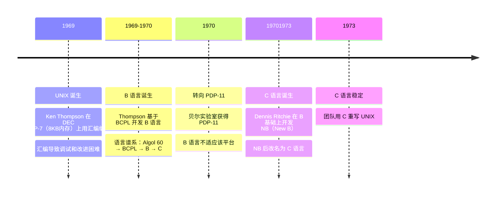
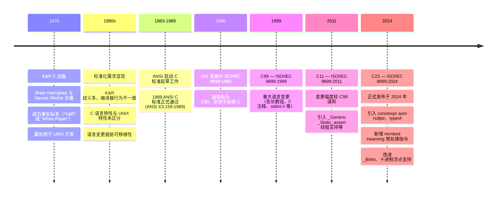

# 现代 C

C 语言是 20 世纪 70 年代初期在贝尔实验室开发出来的一种编程语言。

## 起源 {#origins}

C 语言是 UNIX 系统从汇编转向高级语言的产物，其诞生直接源于 PDP-11 平台的限制，最终使 UNIX 具备 **可移植性**，成为现代操作系统的基础。

1969 年，由 Ken Thompson 在 DEC PDP-7（仅 8KB 内存）上用汇编语言独立编写 UNIX 操作系统。1969-1970 年间，由于汇编语言编写的程序难以调试和改进；Thompson 为解决这些问题，基于 BCPL 语言开发了 B 语言

Dennis Ritchie 也加入到了 UNIX 项目中，并且开始着手用 B 语言编写程序。1970 年贝尔实验室获得 PDP-11，B 语言也经过改进并能够在 PDP-11 计算机上成
功运行后，Thompson 用 B 语言重新编写了部分 UNIX 代码

1971 年，B 语言已经明显不适合 PDP-11了，Dennis Ritchie 在 B 基础上开发 NB（New B），后改名为C语言。1973 年 C 语言稳定，团队用 C 重写 UNIX。C 语言带来一非常重要的好处：**可移植性**

!!! tip "关键收益：可移植性"

    通过为不同机器编写 C 编译器，UNIX 可跨平台运行，摆脱硬件依赖。

下面是 C 语言起源的完整时间线

## 标准化 {#standardization}

C语言从 K&R 非正式标准起步，因可移植性压力催生 ANSI/ISO 标准化，历经 C89、C99、C11 到 C18，逐步发展为成熟、稳定的系统编程语言。

1978年 Brian Kernighan 与 Dennis Ritchie 合著《C程序设计语言》，成为事实上的 C 语言标准，俗称 K&R。

当时 C 用户多为 UNIX 开发者，20 世纪 80 年代后随 IBM PC 等平台普及，C 语言迅速普及，从而导致一列的问题出现。由于为新平台编写 C 编译器的程序员都参考 K&R。但是，K&R 对一些语言特性的描述非常模糊，以至于不同的编译器常常会对这些特性做出不同的处理；并且，K&R 也没有对属于C 语言的特性和属于 UNIX 系统的特性进行明确的区分。C 语言本身也在不断的变化，缺少统一规范，从而威胁到了 C 程序的可移植性

1983 年 ANSI 启动 C 标准制订，1988 年完成，1989 年正式通过（ANSI X3.159-1989）。1990年 ISO 采纳为 ISO/IEC 9899:1990（即C89/C90，区别于经典C）。此后，C 语言标准统一由 ISO 进行修订。下面是 C 语言标准化的时间线

