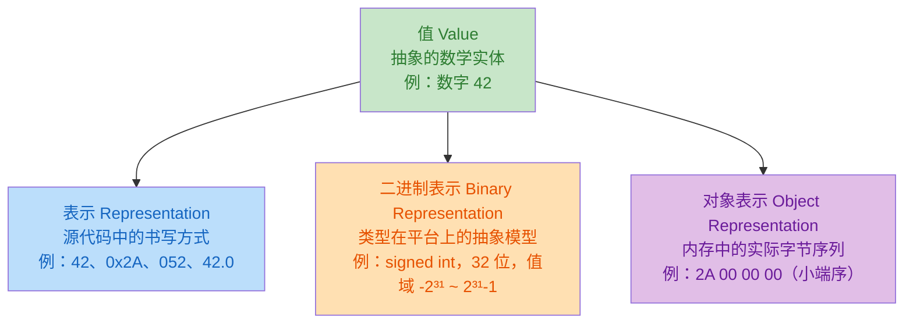
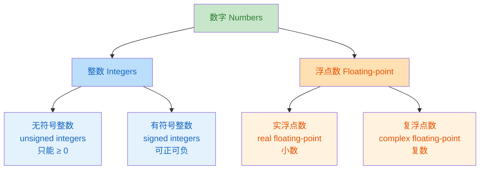

# 基本值和数据

在 [控制语句] 和 [表达式]中，我们学习了 C 程序是如何做事情的。现在，我们换一个视角来学习 C 程序操作的内容，即 **值** 和 **数据**。

C 程序最终操作的内容是 **值**；但是，我还要回答两个最根本问题：**C 程序中的「值」到底是什么？它是怎么在计算机中存在的？**

**值** 就是一种抽象的数学概念；例如，我们在纸片上写下数字 $12$ 时，这里的 $12$ 是数学概念上的数字 $12$ 的阿拉伯数字表示；即**十进制数字系统**。当然，还可以使用其他数字系统表示，例如值 $12$ 文字 **"十二"** 和 **"twelve"** 等。也就是说，我们写在纸片上的数字只是值的符号表示；然而，值的符号表示形式有许多

类似地，计算机上值的表示也可能因体系结构的不同而不同，或者由程序员赋予的值的类型来决定。因此，如果我们想要编写可移植的代码，我们应该主要考虑值而非其表示形式。在大多数情况下，我们不必关心某个特定值的表示，编译器负责安排值和表示之间的来回转换

<details>
<summary><strong>💡 提示：C 程序主要考虑的是值而不是其表示形式</strong></summary>

现在，请忘记之前学习的关于字节和位操作方面的经验；在 C 程序上考虑值的具体表示形式会妨碍我们理解它

</details>

## 抽象状态机 {#abstract-state-machine}

C 程序可以被看作一台**操纵值的机器**：它不是说 C 程序就是一台机器，而是说我们用这个 **模型** 来理解和描述程序的行为。这个模型就叫 **抽象状态机**。

要理解抽象状态机需要了解三个核心概念: **值**、**类型** 和 **表示**

> **💡 提示：值: 抽象的概念**
> **值** 是一种抽象的数学概念，独立于源代码、编译器和具体表示形式。在 C 程序中，我们说的 **值** 本质上就是 **数字**
>
> **数字也是一个抽象概念**。我们可以用阿拉伯数字 **$42$** 表示它，也可以用罗马数字 **"XLII"** 表示它，也可以用中文 **"四十二"** 表示它；尽管这些表示各不相同，但值是同一个

> **💡 提示：类型：值的属性标签，编译时确定**
> 类型不是值本身的一部分，而是描述了值"是什么种类"。类型决定了值能做什么运算以及运算的结果。例如，同样是除法，`int` 和 `double` 的行为完全不同
>
> ```c
> int a = 5;
> double b = 3.0;
>
> a % 2;    // 合法：int 可以做取模
> b % 2;    // 非法！double 不能做取模
>
> a / 2;    // 结果是 2（整数除法，截断小数）
> b / 2;    // 结果是 1.5（浮点除法，保留小数）
> ```

用数学概念来来说， **类型就是值的集合**，并且在这个集合上定义了某些运算。有了类型，程序的行为就不在依赖于具体的平台实现，而是依赖于类型的规则。**C 程序的可移植性：本质上就是类型规则的可移植性**。

+ `size_t` 类型的加法，在任何平台上都遵循 "无符号整数加法，溢出回绕" 的规则
+ `double` 类型的乘法，在任何平台上都遵循 IEEE 754 浮点规则（或兼容的规则）


> **💡 提示：表示: 值在不同层次的展现**
> 在源代码中，值是以字符序列表示的；然而，C 程序要处理它时需要将值存储在内存中；我们将值在内存中的存储形式称为 **对象表示**。对象的表示它涉及 $3$ 个问题
>
> | 问题     | 说明                                   |
> | -------- | -------------------------------------- |
> | 字节序   | 大端（高位在前）还是小端（低位在前）？ |
> | 填充字节 | 结构体中是否有用于对齐的填充字节？     |
> | 位模式   | 具体的 0 和 1 的排列                   |
>
> 通常情况下，这些问题我们不必关注它，对于理解程序而言它们是有害的。除非我们的程序需要
>
> + 在内存中直接操纵字节（比如序列化/反序列化）
> + 在不同字节序的计算机之间传输数据
>
> 因此，我们引入一个 **二进制表示**；它描述了类型的数学属性，但没有描述值在内存中具体怎么存

C 标准不能完全规定每种类型在每个平台上的行为。比如 `double` 的精度、`int` 的位数。但 C 标准要求：只要你给我两个信息，我就能推导出运算结果：**操作数的值** 和 **平台的特征值**。在给定平台上，表示某个类型值的模型，称为 **二进制表示**。例如，`size_t` 的二进制表示由 `SIZE_WIDTH`（位数）决定；知道位数，就能知道：

+ 值域范围：$[0, 2^{SIZE\_WIDTH} - 1]$
+ 加法溢出规则：$\mod 2^{SIZE\_WIDTH}$
+ 所有运算结果



### 程序状态

程序执行的状态由四部分决定

| 组成       | 含义                   | 是否可控       |
| ---------- | ---------------------- | -------------- |
| 可执行文件 | 编译后的二进制程序     | 编译时确定     |
| 当前执行点 | 程序执行到了哪一行     | 由程序逻辑决定 |
| 数据       | 所有变量在当前时刻的值 | 由程序逻辑决定 |
| 外部干预   | 用户输入、网络数据等   | **不可控**     |

显然，如果去掉外部干预，那么 **相同的可执行文件 + 相同的数据 + 相同的执行点 → 相同的结果**。 这是程序确定性的基础。但 C 要求的更强——它希望 **相同的数据 + 相同的程序文本（不是可执行文件）产生相同的结果**，这样才能保证 **可移植性**。这就引入了类型的概念。

因此，**值、类型和二进制表示确定后，所有计算都是固定的**。程序文本描述了一个 **抽象状态机**；该状态机控制程序如何从一种状态切换到另一种状态。这些转换仅由值、类型和二进制表示决定

> **💡 提示：as-if 规则**
> 程序的执行效果 **如同（as-if）** 按照抽象状态机的描述进行。这句话的含义是：
>
> + 编译器不需要严格按照你写的代码顺序执行
> + 它可以重排、合并、消除任何操作
> + 唯一的要求：可观测状态必须和"按部就班执行"的结果一致

**可观测状态**只有两种：

+ 存储在可寻址内存中的变量值
+ 写到输出设备的内容

### 优化 {#optimization}

现代编译器并不会严格按照你我们的代码执行，它只关心程序的**可观测**状态。只要保证可观测状态最终一致（与按部就班执行的可观测状态），编译器就可以任意调整和省略中间步骤

> **📌 示例：示例: 常量折叠**
> ```c
> double x = 5.0;
> double y = 3.0;
> x = (x * 1.5) - y;
> printf("x is %g\n", x);
> ```
>
> 编译器在编译时就能算出 `x = 4.5`，因此可以直接生成：
>
> ```c
> printf("x is 4.5\n");
> ```
>
> 所有中间计算都在编译时完成，运行时只执行一条 `printf`。

> **📌 示例：示例: 加法合并**
> ```c
> x += 5;
> /* Do something else without x in the meantime. */
> x += 7;
> ```
>
> 编译器可能优化为
>
> ```c
> /* Do something without x. */
> x += 12;
> ```
>
> 只要结果没有明显的差异，编译器就可以对执行顺序进行调整

但有些情况下，优化是被禁止的；例如：

```c
signed int x = INT_MAX;  // 比如 2,147,483,647
x += 1;  // 溢出！
```

对于 `signed int`，溢出是 **未定义行为(Undefined Behavior, UB)**——可能触发异常，终止程序。如果编译器把 `x += 5; x += 7;` 合并为 `x += 12;`，就可能改变程序是否溢出，从而改变可观测状态（程序是否崩溃）。但对于 `unsigned`，溢出是良定义的（回绕），所以编译器可以安全地做这种优化。

> **💡 提示：类型决定了优化的可能性**
> 这就是为什么选择正确的类型（unsigned vs signed）不仅关乎正确性，还关乎性能

## 基本类型 {#basic-types}

C 语言的基本类型系统比较复杂，主要是因为 C 语言诞生于 1970 年，当时计算机硬件差异非常大。C 标准为了兼容这些不同的硬件，并没有限制类型的宽度，而是留给平台自行决定。虽然这种设计带来了可移植性，但是也让程序设计变得比较复杂；因为，在代码中写 `int` 时，不能假设它一定是 $32$ 位

我们可以将 C 语言的基本类型系统分为两层

| 层次       | 来源                | 组织方式          | 示例                                    |
| ---------- | ------------------- | ----------------- | --------------------------------------- |
| **第一层** | 语言关键字          | 按 C 内部机制组织 | `signed int`, `double`, `unsigned long` |
| **第二层** | 头文件（`typedef`） | 按语义/用途组织   | `size_t`, `bool`, `ptrdiff_t`           |

第一层是"底层"的，告诉你类型在硬件层面是什么；第二层是"高层"的，告诉你类型在编程中应该怎么用。实际编程中，**优先用第二层**； `size_t` 比 `unsigned long` 更好，因为它在任何平台上都表示"大小"这个语义，不需要你关心底层实现。

请注意，C 语言中的所有基本值都是数字，但有不同种类的数字。作为一个主要的区别，我们有两类不同的数字，每一类都有两个子类



这四个类中的每个都包含几个类型；它们之间的唯一区别就是 **精度**：它决定了特定类型允许的值的合法范围。下表列出了这些类型

| 类别           | 系统名称             | Rank | 类别              | 系统名称               | Rank |
| -------------- | -------------------- | ---- | ----------------- | ---------------------- | ---- |
| **无符号整数** | `bool`               | 0    | **有/无符号整数** | `char`                 | 1    |
|                | `unsigned char`      | 1    | **有符号整数**    | `signed char`          | 1    |
|                | `unsigned short`     | 2    |                   | `signed short`         | 2    |
|                | `unsigned int`       | 3    |                   | `signed int`           | 3    |
|                | `unsigned long`      | 4    |                   | `signed long`          | 4    |
|                | `unsigned long long` | 5    |                   | `signed long long`     | 5    |
| **实浮点数**   | `float`              |      | **复浮点数**      | `float _Complex`       |      |
|                | `double`             |      |                   | `double _Complex`      |      |
|                | `long double`        |      |                   | `long double _Complex` |      |

共 $18$ 种基本类型，分属 $4$ 个类别。整数类型按 `rank` 递增，值域逐级扩大；浮点类型无统一 `rank`，精度由平台决定

### 类型的值域 {#value-domain}

有符号整数的包含关系为

$$
\texttt{signed char} \subseteq \texttt{short} \subseteq \texttt{int} \subseteq \texttt{long} \subseteq \texttt{long long}
$$

C 标准规定：**`rank` 高的类型的值域必须包含 `rank` 低的类型的值域**。但这种包含**不一定是严格**的——在某些平台上 `int` 和 `long` 的值域完全相同（尽管它们是不同的类型）

无符号整数与有符号整数具有同样的包含关系，同样不一定是严格的。

$$
\begin{matrix}
\texttt{bool} \subseteq \texttt{unsigned char} \subseteq \texttt{unsigned short} \subseteq \texttt{unsigned} \\
\subseteq \texttt{unsigned long} \subseteq \texttt{unsigned long long}
\end{matrix}
$$

有符号类型的非负值总是能放进相同 `rank` 的无符号类型中。而且在现代平台上，这个包含是严格的——无符号类型的值域更大。举例（32 位平台）：

+ `signed int`：$[−2,147,483,648, 2,147,483,647]$
+ `unsigned int`：$[0, 4,294,967,295]$

`signed int` 的非负部分 $[0, 2,147,483,647]$ 是 $[0, 4,294,967,295]$（`unsigned int` 的范围）真子集。但 `unsigned int` 有一些值（如 3,000,000,000）放不进 `signed int`。


### 窄类型与整数提升 {#narrow-types-and-integer-promote}

18 种基础类型中，有 6 种是 **窄类型**；这些类型的共同特点是：**它们的 rank 低，值域小于或等于 signed int**。这些窄类型包括

```
窄类型：
  bool (_Bool)
  char
  signed char
  unsigned char
  short (signed short)
  unsigned short
```

> **💡 提示：窄类型在参与运算之前会被自动提升**
> 窄类型在参与算术运算之前，会被自动**提升**为更宽的类型。原因是：CPU 的算术电路通常以 **"字"** 为单位工作，直接用 char 做加法反而效率更低——先把 char 提升到 int，再用 CPU 的原生字长做运算，更快。
>
> 所有窄类型，无论有符号还是无符号，都被提升为 `signed int`。这一点很反直觉——你可能以为 `unsigned short` 会被提升为 `unsigned int`，但实际上它被提升为 `signed int`。为什么？因为 `unsigned short` 的值域 $[0, 65535]$ 完全能放进 `signed int` 的值域 $[-2^{31}, 2^{31}-1]$ 中，不会丢失信息。

例如：

```c
unsigned short a = 40000;
unsigned short b = 30000;
int c = a + b;
```

逐步分析：

+ `a` 和 `b` 是 `unsigned short`，属于窄类型
+ 算术运算前，它们被提升为 `signed int`
+ `a` 的值 `40000` → `signed int` 的 `40000`（无信息丢失）
+ `b` 的值 `30000` → `signed int` 的 `30000`（无信息丢失）
+ `40000 + 30000 = 70000`，类型为 `signed int`
+ 赋值给 `int c`，值为 `70000`

整个过程中没有任何问题。但如果：

```c
unsigned short a = 40000;
unsigned short b = 40000;
int c = a + b;  // 80000，仍然在 signed int 范围内（假设 32 位 int）
```

$80000 \lt 2,147,483,647$，所以也没问题。窄类型提升为 `signed int` 在实践中几乎不会出问题——因为窄类型的值域太小了，怎么加都不太可能溢出 `signed int`

### char 的特殊性 {#char-speciality}

**`char` 的有无符号性是平台决定的**，不是标准规定的。这意味着：如果你需要明确的有符号性，用 `signed char` 或 `unsigned char`，不要裸用 `char`

```c
char c = 200;
// 在某些平台上，c 的值是 200（char 是 unsigned）
// 在另一些平台上，c 的值是 -56（char 是 signed）
```

> **💡 提示**
> `char` 的用途是字符处理（文本），不是算术。做算术时，用明确的 `signed` 或 `unsigned` 类型。

## 语义类型 {#semantic-types}

除了关键字定义的基础类型，标准库还通过 typedef 提供了一些语义类型——它们的名字暗示了用途：

| 类型        | 头文件       | 含义                    | 典型用途                  |
| ----------- | ------------ | ----------------------- | ------------------------- |
| `size_t`    | `<stddef.h>` | 大小、基数              | `sizeof` 返回值、数组下标 |
| `ptrdiff_t` | `<stddef.h>` | 指针差值                | 两个指针相减              |
| `uintmax_t` | `<stdint.h>` | 最大宽度无符号整数      | 预处理器算术              |
| `uint{N}_t` | `<stdint.h>` | 宽度为 `N` 的无符号整数 | 预处理器算术              |
| `intmax_t`  | `<stdint.h>` | 最大宽度有符号整数      | 预处理器算术              |
| `int{N}_t`  | `<stdint.h>` | 宽度为 `N` 的有符号整数 | 预处理器算术              |
| `time_t`    | `<time.h>`   | 日历时间（秒）          | `time(0)` 返回值          |
| `clock_t`   | `<time.h>`   | 处理器时钟周期          | `clock()` 返回值          |

类型 `time_t` 和 `clock_t` 用于时间处理。它们的具体精度因平台而异，所以它们是"语义类型"——你只关心"这是时间"，不关心它在底层是 $32$ 位还是 $64$ 位。

```c
#include <time.h>

time_t now = time(0);  // 当前时间（自 epoch 以来的秒数）
clock_t ticks = clock();  // 处理器时钟周期数
double seconds = (double)ticks / CLOCKS_PER_SEC;  // 转换为秒
```

## 字面值 {#literal-value}

**字面量** 就是直接写在代码中的固定值。它不是变量，不是表达式，而是 **"字面上就是这个值"**。C 语言提供了多种方式来书写同一个值——就像人类可以用"42"、"四十二"、"XLII"表示同一个数字一样。

### 整数字面值 {#integer-literal-value}

C 标准规定了 $4$ 种形式的整数字面值，它们的表示形式如下表

| 进制              | 前缀 | 示例     | 值    | 说明                  |
| ----------------- | ---- | -------- | ----- | --------------------- |
| **十进制**        | 无   | `123`    | 123   | 最常用                |
| **八进制**        | `0`  | `077`    | 63    | 以 `0` 开头，历史遗留 |
| **十六进制**      | `0x` | `0xFFFF` | 65535 | 以 `0x` 开头          |
| **二进制（C23）** | `0b` | `0b1010` | 10    | 以 `0b` 开头          |

<details>
<summary><strong>📖 引用：位置数字系统</strong></summary>

十进制表示形式是是我们最常用的表示形式；总共使用 $10$ 个基本数符 $\{0, 1,2,3,4,5,6,7,8,9\}$ 表示。对于十进制数 $d_{n-1}d_{n-2}\cdots d_{1}d_{0}$ 表示的值为

$$
\text{Value}=\sum_{i=0}^{n-1}10^{i}\times d_{i}
$$

其中 $d_{i} \in \{0, 1,2,3,4,5,6,7,8,9\}$；$10$ 称为**基数**，即基本数符的数量

---

我们之前提到过，二进制表示形式是某一类型值的模型；这意味着计算机内存中是以 **二进制模式(位模式)** 来存储数据的；它只是使用 $2$ 个基本数符 $\{0,1\}$ 表示。对于二进制数 $b_{n-1}b_{n-2}\cdots b_{1}b_{0}$ 表示的值为

$$
\text{Value}=\sum_{i=0}^{n-1}2^{i}\times b_{i}
$$

其中 $b_{i} \in \{0, 1\}$；$2$ 称为**基数**，即基本数符的数量

---

十六进制表示形式也是程序中常用的表示形式：总共使用 $16$ 个基本数符 $\{0, 1,2,3,4,5,6,7,8,9,A,B,C,D,E,F\}$ 表示。对于十六进制数 $h_{n-1}h_{n-2}\cdots h_{1}h_{0}$ 表示的值为

$$
\text{Value}=\sum_{i=0}^{n-1}16^{i}\times h_{i}
$$

其中 $h_{i} \in \{0, 1,2,3,4,5,6,7,8,9,A,B,C,D,E,F\}$；$16$ 称为**基数**，即基本数符的数量

---

八进制表示形式属于历史遗留，目前很少在程序中使用：八进制总共使用 $8$ 个基本数符 $\{0, 1,2,3,4,5,6,7\}$ 表示。对于八进制数 $o_{n-1}o_{n-2}\cdots o_{1}o_{0}$ 表示的值为

$$
\text{Value}=\sum_{i=0}^{n-1}8^{i}\times o_{i}
$$

其中 $o_{i} \in \{0, 1,2,3,4,5,6,7\}$；$8$ 称为**基数**，即基本数符的数量

</details>

每个字面值都有一个 **类型**。对于整数类型的字面值，其类型推导遵循以下四条规则

+   规则一: **字面量永远非负**

    ```c
    -34 // 不是"负三十四的字面量"
        // 而是"对字面量 34 做一元取负运算"
    ```

+   规则二: 十进制整数字面量是有符号的

    ```c
    1 // 类型：signed int（不是 unsigned int）
    ```

+   规则三: 十进制整数取 **第一个能放下的有符号类型**

    三个有符号类型按 `rank` 排列：`signed int → signed long → signed long long`。十进制字面量的类型是第一个能放下它的

    假设在某个平台上（`int` 类型占 $16$ 为）：

    | 字面量  | 值    | 放得进 `signed int`？ | 类型          |
    | ------- | ----- | --------------------- | ------------- |
    | `32767` | 32767 | ✅                     | `signed int`  |
    | `32768` | 32768 | ❌（超过 32767）       | `signed long` |

    在 $16$ 位 `int` 的平台上，`signed int` 的最小值是 $-32768$，但你无法用一个字面量直接表示它！因为：

    + `32768` 的类型是 `signed long`（放不进 `signed int`）
    + `-32768` 是对 `signed long` 字面量做取负运算，结果还是 `signed long`

+   规则四: 二/八/十六进制字面量的类型可以是有符号类型也可以是无符号类型

    十进制字面量只选有符号类型。但二/八/十六进制字面量无放不进有符号类型的情况下可以选无符号类型。换句说，二/八/十六进制的字面的推导顺序为: `signed int → unsigned int → signed long → unsigned long → signed long long → unsigned long long`。例如，在一个 `int` 类型为 $16$ 位的平台上

    ```c
    0x7FFF      // 值 32767 → signed int（放得下）
    0x8000      // 值 32768 → unsigned int（放不进 signed int）
    0xFFFF      // 值 65535 → unsigned int
    ```

> **⚠️ 注意：警告: 负值一律使用十进制字面值**
> ```c
>     int x = 0xFFFF'FFFF;
>     // 你可能以为得到的是 -1（因为补码表示）
>     // 但实际上 0xFFFF'FFFF 是 unsigned int，值为 4,294,967,295
>     // 赋给 int 时发生窄化转换，结果是实现定义的
>     ```

#### 整型字面值后缀 {#integer-literal-value-suffix}

对于整数字面值，我们可以使用下表列出的后缀来强制确定字面值的类型

| 后缀                | 效果        | 示例   | 值   | 类型               |
| ------------------- | ----------- | ------ | ---- | ------------------ |
| `U` 或 `u`          | 强制无符号  | `1U`   | 1    | `unsigned`         |
| `L` 或 `l`          | 至少 `long` | `1L`   | 1    | `signed long`      |
| `LL` 或 `ll`        | `long long` | `1LL`  | 1    | `signed long long` |
| `WB` 或 `wb`（C23） | 精确位宽    | `42wb` | 42   | `_BitInt(N)`       |

这些后缀形式可以组合使用

| 后缀         | 示例    | 类型                 |
| ------------ | ------- | -------------------- |
| `UL`         | `1UL`   | `unsigned long`      |
| `ULL`        | `1ULL`  | `unsigned long long` |
| `UWB`（C23） | `42uwb` | 无符号 `_BitInt(N)`  |

> **💡 提示：后缀形式的推导规则**
> + 对于十进制字面量：`L → long`（如果值放得下）或 `long long`（放不下时）；`LL` → 固定 `long long``
> + 对于二/八/十六进制字面量：`L` 可能是 `unsigned long`（如果值放不进 `signed long`）
> + `U` 可以强制无符号

### 浮点数字面值 {#floating-point-literal-value}

下表总结了 C 语言中 $3$ 种浮点数字面值形式

| 形式         | 示例                | 解释                    |
| ------------ | ------------------- | ----------------------- |
| 小数形式     | `3.14`, `.00007`    | 可省略前导零或尾部      |
| 科学记数法   | `1.7E-13`, `3.E+25` | $mEe = m \times 10^{e}$ |
| 十六进制浮点 | `0x1.7aP-13`        | $hPe = h \times 2^{e}$  |

小数形式是最常用的浮点数表示形式，其前导零或尾部零都可以省略；科学计数法形式也是小数形式的扩展。十六进制浮点数通常用于以一种易于指定 **具有精确表示的值的形式** 来描述浮点值；换句话说，浮点数的十六进制与其二进制表示精确对应，不会有舍入误差

> **💡 提示**
> 默认情况下，浮点数字面值的类型是 `double` 而不是 `float`。可以使用浮点数字面值后缀强制指定类型
>
> | 后缀       | 类型          | 示例   |
> | ---------- | ------------- | ------ |
> | 无后缀     | `double`      | `0.2`  |
> | `f` 或 `F` | `float`       | `0.2F` |
> | `l` 或 `L` | `long double` | `0.2L` |

####  浮点精度陷阱 {#precision-traps}

浮点字面量的实际值可能与你写的值不同。因为浮点数在计算机中用二进制存储，而很多十进制小数无法用二进制精确表示。例如，$0.2$ 在我使用的机器的实际值是：

```
0.200,000,000,000,000,011,1...
```

这就像十进制中 `1/3 = 0.333...` 无法精确表示一样；$0.2$ 在二进制中也是无限循环小数：

```
0.2（十进制）= 0.001100110011...（二进制，无限循环）
```

由于十进制浮点数的不精确表示，往往会带来严重的后果

```c
0.2 == 0.2000000000000000111  // 可能为 true！
// 两个不同写法的字面量，实际值相同
```

对于不同类型的 $0.2$，实际值也不同；因为它们的精度不同（32 位 vs 64 位 vs 80/128 位），舍入的位置也不同。

|                    | `float`           | `double`                 | `long double`                |
| ------------------ | ----------------- | ------------------------ | ---------------------------- |
| 字面量             | `0.2F`            | `0.2`                    | `0.2L`                       |
| 实际值（十六进制） | `0x1.9999'9AP-3F` | `0x1.9999'9999'9999AP-3` | `0xC.CCCC'CCCC'CCCC'CCDP-6L` |

#### 十六进制浮点数优势 {#advantages-hex-float-point}

十六进制浮点字面量就是为了解决精度问题而设计的——**它能精确对应二进制表示**：

```c
0x1.9999'9AP-3    // 精确等于 1.60000002384 × 2⁻³ ≈ 0.20000000298
0xC.CCCC'CCCC'CCCC'CCDP-6  // 精确等于 12.8000000000000000002 × 2⁻⁶ ≈ 0.200000000000000000003
```

两个值非常接近，但十六进制写法看起来差异很大。这说明：十进制写法给人的直觉是错的——你以为 $0.2$ 就是精确的 $0.2$，但实际上它只是近似值

> **💡 提示：字面量有三个属性：值、类型、二进制表示**
> 同一个值（如 0.2）可以有不同的类型（float/double/long double），每种类型有不同的二进制表示，因此实际值也不同

### 字符字面值 {#char-literal#}

在 C 语言中，字符字面值使用单引号 `'...'` 标记。例如

```c
'a'     // 字符 a，值为 97（ASCII 编码）
'?'     // 问号
'\n'    // 换行符（转义字符）
'\0'    // 空字符，值为 0
'\\'    // 反斜杠本身
'\''    // 单引号本身
'\"'    // 双引号（也可以写成 '"'）
```

> **⚠️ 注意**
> 重要细节：**字符字面量的类型是 `int`，不是 `char`！**
>
> ```c
> sizeof('a')     // 在大多数平台上是 4（int 的大小），不是 1
> sizeof(char)    // 总是 1
> ```

### 字符串字面量 {#string-literal}

在 C 语言中，字符串字面值使用双引号 `"..."` 标记。例如

```c
"hello"         // 字符串字面量
"first line\n"  // 包含转义字符
```

编译器会将相邻的字符串字面值自动拼接；这个特性对于写长字符串非常有用，我们可以在源码中将字符串分成多行，编译器会在编译时自动合并

```c
puts("first line\n"
     "another line\n"
     "first and "
     "second part of the third line");
// 等价于：
puts("first line\nanother line\nfirst and second part of the third line");
```

> **📝 说明：补充**
> `printf` 在进行格式化输出时，如果想要输出字符 `%` 需要使用 `%%`
>
> ```c
> printf("成功率: 100%%\n");  // 输出：成功率: 100%
> ```

### 复数字面量 {#complext-literal}

**C 语言没有复数字面量**，我们不能直接写 `3+4i`。但有两种方式指定复数：

+ 使用 `<complex.h>` 头文件中提供的宏 `CMPLX(rel, img)`

    ```c
    #include <complex.h>
    double complex z = CMPLX(3.0, 4.0);   // 3 + 4i
    float complex w = CMPLXF(1.0f, 2.0f); // 1 + 2i
    ```

+ 使用虚数单位 `I`，它也是头文件 `<complex.h>` 中提供的宏

    ```c
    #include <complex.h>
    double complex z = 3.0 + 4.0 * I;     // 3 + 4i
    float complex w = 1.0f + 2.0f * I;    // 1 + 2i
    ```

> **⚠️ 注意**
> 不要在程序中把 `I` 用作其他用途的宏名——它是标准保留的。

## 隐式类型转换 {#implicit-conversion}

计算机在执行算术运算符时，要求两个操作数具有相同的尺寸和相同的表示方式。换句话说，两个操作数必须相同的类型。然而，C 语言运行不同类型的值混合运算；在这种情况下，编译器必须将两个操作数的类型统一；这种由编译器执行的类型统一称为 **隐式类型转换**

```c
int a = 5;
double b = 3.0;

a + b;  // int 和 double 的表示方式和尺寸完全不一样，不能直接相加，需要转换
```

### 赋值时的隐式转换

首先，我们假设 `signed int` 类型的能够表示整数的范围是 $[-2147483648, 2147483647]$

**值在目标类型范围内，转换是无害的**。下面两个变量 `a` 和 `b` 的初始化是无害的。相应的值完全在所需类型的范围内，因此编译器可以成功的转换它们

```c
double       a =  1; // OK: 1 在 double 范围内，无害
signed short b = -1; // OK: -1 在 signed short 范围内，无害
```

**值超出目标类型范围，此时的转换会依赖于具体的实现**；程序可以重用右边的位模式，也可以终止程序

```c
signed int c =  0x80000000;  // 危险: 0x80000000 是 unsigned int，超出 signed int 范围
```

> **⚠️ 注意：尽量避免程序中使用由实现定义的行为**
> 由实现定义的特性必须根据平台文档说明选择哪种解决方案，但是，可能随编译器版本改变而改变

变量 `d` 的初始化情况会更加复杂: `0x80000000` 的值是 `2147483648`，我们可能会认为 `-0x80000000` 就 `-2147483648`。但是，实际上 `-0x80000000` 的值还是 `0x80000000`

```c
signed int d = -0x80000000; // 危险: 同样危险！-0x80000000 还是 0x80000000
```

**对于无符号类型，值太大时按模运算（$mod 2^n$）转换**。如果我们假定 `unsigned short` 的最大值是 $2^{16}-1$，那么结果值为 $0$。这种 **缩小** 的转换是否是期望的结果往往很难判断

```c
unsigned short  g =  0x80000000;    // 信息丢失: 值为 0
```

> **🚨 危险：关键规则**
> + **避免窄化转换**：把大范围的值塞进小范围的类型
> + **不要在算术运算中使用窄类型**

### 混合类型运算

当运算符的两个操作数类型不同时，规则更复杂。通常情况下，如果操作数包含浮点数，那么其他类型的操作数转换为浮点数类型；但是，请注意精度损失

```c
1 + 0.0;       // 无害：1 转换为 double，结果是 double
1 + I;         // 无害：1 转换为 complex float，结果是 complex float
INT_MAX + 0.0F; // 危险：INT_MAX 可能无法精确表示为 float
INT_MAX + 0.0;  // 通常无害：double 精度足够
```

当有符号和无符号类型混合运算时，有符号值会被转换为无符号值。这种情况下，会出现一些非常危险的行为

```c
-1 < 0;      // True，无害
-1U < 0U;    // False，无害（-1U 是大正数）
-1 < 0U;     // False，危险！混合有符号和无符号整数
-1U < 0;     // False，危险！混合有符号和无符号整数
```

下表列出了每个表达式的结果

| 表达式     | 结果     | 原因                              |
| ---------- | -------- | --------------------------------- |
| `-1 < 0`   | True     | 同一类型，正常比较                |
| `-1U < 0U` | False    | `-1U` 是 `UINT_MAX`，是大正数     |
| `-1 < 0U`  | False    | `-1` 转换为 `UINT_MAX`，然后比较  |
| `-1L < 0U` | 依赖平台 | 取决于 `int` 和 `long` 的宽度关系 |


> **🚨 危险：混合有符号和无符号数比较的陷阱**
> ```c
> int a = -1;
> unsigned int b = 0;
>
> if (a < b) {
>     printf("a < b\n");  // 不会执行！
> } else {
>     printf("a >= b\n");  // 会执行！
> }
> ```
>
> 这是因为 `-1` 被转换为 `UINT_MAX`，然后与 `0` 比较。`UINT_MAX` 是一个大整数

因此，在实际编程中，应该遵守以下建议

```c
// ❌ 危险：混合有符号和无符号类型的比较: 有符号值会被转换为无符号值
int len = -1;
if (len < strlen(str)) {  // len 会被转换为 unsigned
    // ...
}

// ✅ 安全：统一类型
size_t len = 0;
if (len < strlen(str)) {
    // ...
}

// ❌ 危险：窄化转换
unsigned short x = 0x8000'0000;  // 信息丢失

// ✅ 安全：使用足够宽的类型
unsigned int x = 0x8000'0000;
```

## 初始化 {#initialization}

初始化器帮助我们保证程序执行始终处于确定状态——任何时候访问一个对象，它都有一个已知的值。这是抽象状态机的核心要求：**程序的状态必须是确定的、可预测的**。如果一个变量没有初始化，它的值就是不确定的，直接读取它是 **未定义行为**

> **⚠️ 注意**
> **所有变量都应该初始化**。 唯一的例外是需要高度优化的代码——但对于大多数代码来说，现代编译器能追踪值的来源，多余的初始化会被优化掉，不会影响性能。

### 标量类型的初始化器 {#initialization-scalar}

标量类型（整数、浮点数）的初始化器是一个可以转换为该类型的表达式，可以选择用 `{...}` 包围

```c
double a = 7.8;     // 直接赋值
double b = 2 * a;   // 表达式（编译时 b = 15.6）
double c = { 7.8 }; // 花括号形式（合法，但不常用）
double d = { 0 };   // 花括号形式
```

> **💡 提示**
> 这四种写法都是合法的。`{}` 形式在标量类型中不常用，但在聚合类型（数组、结构体）中是必须的。

### 数组的初始化器 {#initialization-array}

数组的初始化器必须用 `{...}` 包围，元素之间用逗号分隔。C 标准提供两种形式的数组初始化

+ 顺序初始化: 按照初始化器中元素出现的顺序依次初始化数组元素

    ```c
    double A[] = { 7.8 };              // 1 个元素：A[0] = 7.8
    double B[3] = { 2 * A[0], 7, 33 }; // 3 个元素：B[0]=15.6, B[1]=7, B[2]=33
    ```

    如果省略数组大小 `[]`，编译器会根据初始化器推导长度：

    ```c
    double A[] = { 7.8 };       // A 只有 1 个元素
    double C[] = { [0] = 6, [3] = 1 };  // C 有 4 个元素（最大下标 + 1）
    ```

+ 指示器初始化: `[0] = 6` 和 `[3] = 1` 叫 **指示器**，它明确指定了每个值对应哪个下标。未被指示器覆盖的元素自动初始化为 $0$
    ```c
    double C[] = { [0] = 6, [3] = 1 };
    ```

    ```mermaid
    graph TD
        V0["6.0"] -->|"指定为 6"| C0["C[0]"]
        V1["0.0"] -->|"未指定→0"| C1["C[1]"]
        V2["0.0"] -->|"未指定→0"| C2["C[2]"]
        V3["1.0"] -->|"指定为 1"| C3["C[3]"]

        style C0 fill:#C8E6C9,color:#2E7D32
        style C1 fill:#E0E0E0,color:#616161
        style C2 fill:#E0E0E0,color:#616161
        style C3 fill:#C8E6C9,color:#2E7D32
        style V0 fill:#BBDEFB,color:#1565C0
        style V1 fill:#F5F5F5,color:#9E9E9E
        style V2 fill:#F5F5F5,color:#9E9E9E
        style V3 fill:#BBDEFB,color:#1565C0
    ```

    使用指示器初始化数组带来一些好处

    ```c
    // 顺序初始化：依赖位置，容易出错
    double B[3] = { 15.6, 7, 33 };
    // 如果后来在前面插入一个元素，后面全部错位

    // 指示器初始化：不依赖位置，更健壮
    double B[3] = { [0] = 15.6, [1] = 7, [2] = 33 };
    // 插入元素后，其他元素不受影响
    ```

下面的代码片段演示了指示器初始化语法的使用方式

```c
// 乱序
int arr[5] = { [3] = 30, [0] = 10, [2] = 20 };
// arr = {10, 0, 20, 30, 0}

// 重复（后面的覆盖前面的）
int arr2[5] = { [0] = 1, [0] = 2 };
// arr2 = {2, 0, 0, 0, 0}

// 省略中间元素
int arr3[5] = { [0] = 1, [4] = 5 };
// arr3 = {1, 0, 0, 0, 5}
```

> **💡 提示：所有聚合类型（数组、结构体）都应该使用指示器初始化**
> 指示器是 C99 引入的特性，在 [快速入门] 的第一个示例程序中已经用到了：
>
> ```c
> double A[5] = {
>     [0] = 9.0,
>     [1] = 2.9,
>     [4] = 3.E+25,
>     [3] = .00007,
> };
> ```

### 默认初始化器 {#default-initializer}

C23 引入了一个重要特性：空花括号 `{}` 可以初始化任何类型的对象，效果是将所有成员初始化为零。

```c
int x = {};           // x = 0
double y = {};        // y = 0.0
int arr[10] = {};     // 所有元素为 0
struct { int a; double b; } s = {};  // a = 0, b = 0.0
```

在 C23 之前，你需要写 `{0}` 而不是 `{}`：

```c
int arr[10] = {0};    // C89/C99/C11：第一个元素初始化为 0，其余自动为 0
int arr[10] = {};     // C23：更简洁，效果相同
```

### 未初始化的变量 {#uninitialized-variables}

如果一个变量没有被初始化，它的值是**不确定**的：

```c
int x;          // 未初始化
printf("%d", x); // 未定义行为！x 的值不确定
```

这不仅仅是"值是 0 还是随机"的问题——**读取未初始化的变量是未定义行为**，编译器可以做任何事（包括让程序崩溃、输出奇怪的值、或者"看起来正常"但埋下隐患）。

```c
int x = 0;      // ✅ 初始化了，值确定为 0
int y;           // ❌ 未初始化，读取是未定义行为
int z = {};      // ✅ C23，等价于 z = 0
```

### 初始化 vs 赋值 {#initialization-vs.-assignment}

初始化和赋值是不同的概念；下表对比了二者的不同

|            | 初始化                        | 赋值                    |
| ---------- | ----------------------------- | ----------------------- |
| **时机**   | 对象定义时                    | 对象已存在后            |
| **语法**   | `int x = 5;`                  | `x = 5;`                |
| **花括号** | 聚合类型必须用 `{}`           | 不能用 `{}`             |
| **const**  | 可以初始化 `const int x = 5;` | 不能赋值给 `const` 对象 |

```c
int x = 5;       // 初始化
x = 10;          // 赋值

const int y = 5;  // 初始化 ✅
y = 10;           // 编译错误！const 对象不能赋值

int arr[3] = {1, 2, 3};  // 初始化 ✅
arr = {4, 5, 6};          // 编译错误！不能对数组赋值
```

## 命名常量

在程序中，我们经常使用一些具有特殊意义的数值。如果这些数值直接写死在代码里（称为"魔法数字"），会带来严重问题：

```c
// ❌ 糟糕的代码：魔法数字
char const *const bird[3] = { "raven", "magpie", "jay" };
char const *const pronoun[3] = { "we", "you", "they" };
char const *const ordinal[3] = { "first", "second", "third" };

for (unsigned i = 0; i < 3; ++i)  // 这里的 3 是什么含义？
    printf("Corvid %u is the %s\n", i, bird[i]);
```

在上述代码片段中，`3` 在代码中出现了多次，但是它们的含义各不相同。如果要添加一种鸟类，需要修改多处代码。因此，在程序中，我们应该遵循两条规则

+ **所有具有特定含义的常量必须命名**
+ **所有含义不同的常量必须区分**

C 语言提供了 $5$ 中创建命名常量的方式。在 [快速入门] 中我们已经介绍 **宏替换**。现在，我们补充上其他四种命名常量

### 运行时常量

`const` 限定符表示对象是 **只读的**，不能修改

```c
char const *const bird[3] = { "raven", "magpie", "jay" };
// bird 不能被修改，bird[i] 也不能被修改
```

请注意，**`const` 限定类型的对象是只读的**，它不等于常量。例如，我们可以声明一个只读变量 `factor`，它的值可能在其他地方定义，可能在运行时才确定

```c
extern double const factor;  // 声明一个只读变量
// factor 的值在其他地方定义，可能在运行时才确定
```

不幸的是，还有另一类只读对象，其没有受到其类型的保护而不被修改：字符串字面值。出于历史原因，`const` 关键字在字符串字面量之后才引入 C 语言，所以字符串字面量的类型不是 `char const[]`，而是 `char[]`。但它们仍然是只读的。

```c
char *str = "hello";  // ⚠️ 字符串字面量是只读的！
str[0] = 'H';         // ❌ 未定义行为！
```

> **💡 提示**
> 虽然字符串字面值的类型是 `char[]`。但是，声明的字符指针是指向字符串字面值的，我们应该声明为 `char const *`

### 编译时常量

C23 标准引入了 `constexpr` 关键字，它创建 **编译时确定的只读对象**

```c
extern double const factor;           // 只读，但值可能运行时才确定
constexpr double π = 3.141592653589793;  // 编译时确定，永远不变
```

### 枚举

枚举是 C 语言中命名小整数的传统机制，由关键字 `enum` 创建

```c
enum corvid { magpie, raven, jay, chough, corvid_num };
// magpie = 0, raven = 1, jay = 2, chough = 3, corvid_num = 4
```

默认情况下，枚举列表中的第一个值是整数 $0$，随后的每个枚举的值都是前一个枚举值加 $1$；这种由编译器根据枚举列表分配的枚举常量称为 **位置值**。当然，我们可以显示指定枚举的值

```c
enum flags {
    FLAG_A = 1,
    FLAG_B = 2,
    FLAG_C = 4,
    FLAG_D = 8
};
```

默认情况下，如果枚举列表的中的所有枚举值都可以放入 `signed int`，那么它们的类型就是 `signed int`

```c
enum small { A, B, C };  // A, B, C 的类型是 signed int

enum large {
    X = 0,
    Y = 0xFFFF'FFFF  // 超出 signed int 范围
};
// Y 的类型可能是 unsigned int 或更大的类型
```

从 C23 标准起，允许我们显示指定底层类型。通常情况下，应该在枚举常量可能超出 `signed int` 范围，显式指定底层类型。

```c
// 自动调整底层类型
enum wide {
    minimal = LONG_MIN,
    maximal = LONG_MAX
};

// 显式指定底层类型
enum wider : long {
    minimer = LONG_MIN,
    maximer = LONG_MAX
};

// 指定无符号类型
enum e32 : uint32_t {
    d32 = 0,
    u32 = 0xFFFF'FFFF
};
```

> **⚠️ 注意**
> 枚举常量的值必须是 **整数常量表达式(ICE)**。例如
>
> ```c
> signed const o42 = 42;       // o42 是对象，不是常量
> constexpr signed c42 = 42;   // c42 是命名常量
>
> enum {
>     b42 = 42,          // ✅ 42 是字面量
>     c52 = o42 + 10,    // ❌ 错误！o42 是对象
>     b52 = b42 + 10,    // ✅ b42 是枚举常量
>     d52 = c42 + 10,    // ✅ c42 是 constexpr
> };
> ```

### 复合字面量

C99 标准引入了一种**创建临时对象**的字面量，称为 **复合字面量**:

```c
(T){ INIT }
```

例如，创建一个临时的 `corvid` 名称数组

```c
// 创建一个临时的 corvid 名称数组
#define CORVID_NAME /* */ \
    (char const *const [corvid_num]){ \
        [chough] = "chough", \
        [raven] = "raven", \
        [magpie] = "magpie", \
        [jay] = "jay", \
    }

for (unsigned i = 0; i < corvid_num; ++i)
    printf("Corvid %u is the %s\n", i, CORVID_NAME[i]);
```

> **⚠️ 注意：使用复合字面量的规则**
> + 复合字面量定义的是对象，不是常量
> + 复合字面量的类型应该使用 `const` 进行修饰；

从 C23 标准起，复合字面量的类型允许使用 `constexpr` 进行修，这样带来了下面的两个优势：

+ 编译时检查：值必须精确匹配类型
+ 优化机会：编译器知道数据不会改变

```c
#define CORVID_NAMES /* */ \
    (constexpr char[8][corvid_num]){ \
        [chough] = "chough", \
        [raven] = "raven", \
        [magpie] = "magpie", \
        [jay] = "jay", \
    }
```

### 总结

下表列出了 C 语言中命名常量的 $5$ 中机制

| 机制        | 类型     | 用途       | 限制             |
| ----------- | -------- | ---------- | ---------------- |
| `const`     | 限定符   | 只读对象   | 值可能运行时确定 |
| `constexpr` | 关键字   | 编译时常量 | C23，必须初始化  |
| `enum`      | 类型     | 命名小整数 | 只能是整数       |
| `对象式宏`  | 预处理器 | 文本替换   | 无类型检查       |
| `复合字面量` | 语法     | 临时对象   | 不是常量         |

其中确定是常量的机制只有 $3$ 种：**枚举** `constexpr` 和 **对象式宏**；它们三个的最佳实践

```c
// ✅ 使用枚举命名整数常量
enum { MAX_SIZE = 100 };

// ✅ 使用 constexpr 命名浮点常量（C23）：constexpr 的初始化器必须精确匹配类型
constexpr double PI = 3.141592653589793;

// ✅ 使用宏定义系统相关常量
#define BUFFER_SIZE 4096

// ❌ 避免魔法数字
int arr[100];  // 100 是什么？
```

## 二进制表示与位运算

**二进制表示**是描述类型可能值的**抽象模型**，不同于内存中的对象表示（实际字节存储）。同一个值可以有不同的二进制表示

### 无符号整数

无符号整数的二进制表示非常直观：**用二进制位表示数值**

$$
\text{value} = \sum_{i=0}^{p-1} b_i \cdot 2^i
$$

其中 $p$ 是精度（precision），即二进制位数。这里涉及了几个概念

| 术语       | 英文                        | 含义           |
| ---------- | --------------------------- | -------------- |
| 精度       | precision                   | 二进制位数 $p$ |
| 最低有效位 | LSB (Least Significant Bit) | $b_0$          |
| 最高有效位 | MSB (Most Significant Bit)  | $b_{p-1}$      |


> **💡 提示**
> 很显然，任何整数类型的最大值都是 $2^p - 1$ 的形式；对于超过 $2^p - 1$ 的无符号值，将触发无符号整数的回绕机制，即 $\mod{2^p}$

#### 位集合和位操作

无符号整数可以解释为 **位集合**（bit set）：位 $b_i = 1$ 表示元素 $i$ 在集合中。C 语言提供了 $4$ 种专用于操作位的运算符称为 **按位运算符**

| 运算符 | 集合运算        | 含义     | 示例    |
| ------ | --------------- | -------- | ------- |
| `|`    | $A \cup B$      | 并集(位或) | `A | B` |
| `&`    | $A \cap B$      | 交集(位与) | `A & B` |
| `^`    | $A \Delta B$    | 对称差集(异或) | `A ^ B` |
| `~`    | $V \setminus A$ | 补集(按位取反) | `~A`    |

例如，采用 $16$ 位的无符号整数表示值 $240$ 的位模式是

```
二进制：00000000'11110000
       └──────────────────┘
       b₁₅ ... b₈ b₇ ... b₀

设置的位：b₄=1, b₅=1, b₆=1, b₇=1
对应集合：{4, 5, 6, 7}
```

位运算符号就可以理解为对位集合中的元素进行集合运算。下面的示例代码片段中，假设 `unsigned` 占用 $16$ 位

```c
unsigned A = 240;   // 集合: {4, 5, 6, 7}
unsigned B = 287;   // 集合: {0, 1, 2, 3, 4, 8}

A | B;  // 并集: 511  → {0,1,2,3,4,5,6,7,8}
A & B;  // 交集: 16   → {4}
A ^ B;  // 对称差集: 495  → {0,1,2,3,5,6,7,8}
~A;     // 补集: 65295 → {0,1,2,3,8,9,...,15}
```

位运算的典型应用：**标志位**（Flags）

```c
enum corvid { magpie, raven, jay, chough, corvid_num };

// 每种鸟对应一个位
#define FLOCK_MAGPIE  (1U << magpie)   // 0b0001
#define FLOCK_RAVEN   (1U << raven)    // 0b0010
#define FLOCK_JAY     (1U << jay)      // 0b0100
#define FLOCK_CHOUGH  (1U << chough)   // 0b1000
#define FLOCK_EMPTY   0U
#define FLOCK_FULL    ((1U << corvid_num) - 1)  // 0b1111

int main(void) {
    unsigned flock = FLOCK_EMPTY;

    // 添加鸟
    flock |= FLOCK_JAY;      // {jay}
    flock |= FLOCK_CHOUGH;   // {jay, chough}

    // 检查是否包含某种鸟
    if (flock & FLOCK_CHOUGH)
        printf("有寒鸦！\n");

    // 移除鸟
    flock &= ~FLOCK_JAY;     // {chough}
}
```

#### 移位运算符

移位运算符连接了无符号整数的数值解释和位集合解释。**左移`<<`** 相当于乘以 $2$ 的幂；也就是说，`a << n` 相当于 $a \times 2^{n}$。在下面的示例程序，变量 `A` 占 $16$ 位

```c
A = 240;    // {4, 5, 6, 7}
A << 2;     // 960 → {6, 7, 8, 9}
            // 240 × 4 = 960

A << 9;     // 溢出！位 16 被丢弃
            // 结果：57344 → {13, 14, 15}
```

**右移 `>>`**：相当于除以 $2$ 的幂（向下取整）；也就是说，`a >> n` 相当于 $\lfloor a \div 2^{n}\rfloor$

```c
A = 240;           // {4, 5, 6, 7}
A >> 2;            // 60 → {2, 3, 4, 5}
                   // 240 ÷ 4 = 60
```

#### 布尔类型

`bool` 是无符号类型，只有两个值：`false（0）`和 `true（1）`

```c
#include <stdbool.h>  // C23 之前需要包含

bool flag = true;
flag = 42;  // 赋值后 flag = true（非零值自动转换为 true）
```

> **💡 提示**
> `bool` 的赋值不遵循模运算规则，而是特殊的布尔转换规则。很少需要 `bool` 变量，大多数情况下用 `int` 更灵活

### 有符号整数

有符号整数比无符号整数复杂，涉及两个问题：**溢出时发生什么？** 和 **符号如何表示？** 从 C23 标准开始，有符号整数使用 **二进制补码** 表示；在这个定义中，将最高有效位(Most Significant Bit, MSB)解释为 **负权**

$$
\text{value} = -b_{p-1}\cdot 2 ^{p-1} + \sum_{i=0}^{p-2} b_i \cdot 2^i
$$

在二进制补码表示中，MSB 也称为 **符号位**，其权重为 $-2^{p-1}$。如果符号位被设置为 $1$ 时，则表示值为负，而当设置为 $0$ 时，值为非负。


<details>
<summary><strong>💡 提示：补码: 二进制下的关于基数的补数</strong></summary>

对于 $n$ 位 $r$ 进制数，规定

+ $r^n - a$ 称为 $r$ 进制数 $a$ 的关于 **基数的补数**($r$ 的补数)
+ $r^n - 1 -a$ 称为 $r$ 进制数 $a$ 的关于 **减基数的补数**($r-1$的补数，也称 **减补数**)

如果数 $a$ 是 $n$ 位的 $r$ 进制数，将按照各个数位展开有

$$
\begin{aligned}
a &= a_{n-1}r^{n-1} + a_{n-2}r^{n-2} + \cdots + a_{1}r^{1} + a_{0}r^{0}\\
&= \sum_{i=0}^{n}a_i\cdot r^i
\end{aligned}
$$

根据 $r$ 的补数的定义，我们有

$$
\begin{aligned}
a + b &= r^n \\
\sum_{i=0}^{n}a_i\cdot r^i + b &= r^n\\
&=\sum_{i=0}^{n-1}(r-1)^i + 1\\
b &= \sum_{i=0}^{n-1}(r-1)^i - \sum_{i=0}^{n}a_i\cdot r^i  + 1\\
&= \sum_{i=0}^{n-1}(r - 1 - a_i)r^i + 1
\end{aligned}
$$

也就是说，$r$ 的补数的计算方式就是用 $r-1$ 减去 $a$ 的每一位后再加 $1$。当 $r = 2$ 时，此时基数的补数就是 **二补数**，也就是我们常说的 **补码**

很显然，二进制下 $\underbrace{111\cdots1}_{n位} - a_{n-1}a_{n-2}\cdots a_0$ 的结果等于对 $a$ 按位取反的结果，所以二进制下求一个数的补码只需对其按位取反再加 $1$ 即可。

</details>

下表列出了在精度 $p$ 为 $32$ 时，二进制补码能够表示整数的最小值和最大值：**负数比正数多一个**

| 类型         | 最小值         | 最大值        |
| ------------ | -------------- | ------------- |
| `signed int` | $-2^{p-1}$       | $2^{p-1}-1$     |
| 示例（p=32） | -2,147,483,648 | 2,147,483,647 |

> **⚠️ 注意：有符号溢出是未定义行为**
> ```c
> // 无符号溢出：良定义（回绕）
> for (unsigned i = 1; i; ++i)
>     do_something();  // 最终 i 回绕到 0，循环结束
>
> // 有符号溢出：未定义行为！
> for (signed i = 1; i; ++i)
>     do_something();  // ⚠️ 编译器可能优化为无限循环！
> ```

### 固定宽度整数类型

标准整数类型的宽度因平台而异。`<stdint.h>` 头文件中提供了精确宽度的类型：

| 类型       | 宽度  | 范围               |
| ---------- | ----- | ------------------ |
| `uint8_t`  | 8 位  | $[0, 255]$           |
| `uint16_t` | 16 位 | $[0, 65535]$         |
| `uint32_t` | 32 位 | $[0, 2^{32}-1]$ |
| `uint64_t` | 64 位 | $[0, 2^{64}-1]$         |
| `int8_t`   | 8 位  | $[-128, 127]$        |
| `int16_t`  | 16 位 | $[-32768, 32767]$    |
| `int32_t`  | 32 位 | $[-2^{31}, 2^{31}-1]$      |
| `int64_t`  | 64 位 | $[-2^{63}, 2^{63}-1]$      |

`<stdint.h>` 头文件中提供了一些宏定义，它们表示这些固定宽度整数类型的源信息

```c
#include <stdint.h>

// 宽度
UINT32_WIDTH  // 32
INT64_WIDTH   // 64

// 范围
UINT32_MAX    // 4294967295
INT64_MIN     // -9223372036854775808
INT64_MAX     // 9223372036854775807

// 字面量宏
UINT64_C(42)  // 42ULL（取决于平台）
INT64_C(42)   // 42LL（取决于平台）
```

从 C23 开始，`printf` 支持使用 `%w{N}u` 和 `%w{N}d` 输出固定宽度的整数值

```c
uint32_t n = 78;
int64_t big = INT64_MAX;

printf("n is %w32u, big is %w64d\n", n, big);
```

### 位精确整数类型

C23 引入了 `_BitInt(N)`，可以指定任意精度的整数类型：

```c
unsigned _BitInt(3) u3 = 7wbu;  // 3 位无符号，值 0~7
signed _BitInt(3) s3 = 3wb;     // 3 位有符号，值 -4~3
```

可选的字面值后缀

| 后缀  | 含义                     |
| ----- | ------------------------ |
| `wb`  | 有符号 `_BitInt`         |
| `WB`  | 有符号 `_BitInt`（大写） |
| `wbu` | 无符号 `_BitInt`         |
| `WBU` | 无符号 `_BitInt`（大写） |


```c
// 创建精确宽度的常量
constexpr unsigned _BitInt(3) max3u = -1;    // 0b111
constexpr unsigned _BitInt(4) max4u = -1;    // 0b1111
constexpr unsigned _BitInt(4) high4u = max4u - max3u;  // 0b1000
constexpr signed _BitInt(4) max4s = max3u;   // 0b0111
constexpr signed _BitInt(4) min4s = ~max4s;  // 0b1000
```

### 浮点数表示

浮点类型近似于实数 $\mathbb{R}$ 或复数 $\mathbb{C}$。

浮点值的计算
$$
\text{value} = s \times f \times 2^e
$$

其中：

+ $s$：符号（+1 或 -1）
+ $f$：尾数（mantissa），$1 \leq f < 2$
+ $e$：指数（exponent）

例如

```c
// s = -1, e = -2, f = 1.010（二进制）
// value = -1 × 1.010₂ × 2⁻² = -1 × 1.25 × 0.25 = -0.3125
```

请注意，**浮点运算既不满足结合律，也不满足交换律和分配律**

```c
// 结合律不成立：巨大的数可能导致较小数精度丢失
(1.0E-13 + 1.0E-13) + 1.0  ≠  1.0E-13 + (1.0E-13 + 1.0)

// 精度损失
double x = 1.0E-13;
double y = 1.0;
x + y;  // 可能等于 y（x 太小被忽略）
```

由于浮点数表示存在的精度问题，**永远不要比较浮点值是否相等**

```c
// ❌ 错误
if (a == b) { ... }

// ✅ 正确：比较是否足够接近
#include <math.h>
if (fabs(a - b) < 1E-9) { ... }
```

`<float.h>` 头文件中提供了一些于浮点类型相关的宏

| 宏             | 含义              | 典型值               |
| -------------- | ----------------- | -------------------- |
| `FLT_MANT_DIG` | `float` 尾数精度  | $24$                 |
| `DBL_MANT_DIG` | `double` 尾数精度 | $53$                 |
| `FLT_MIN_EXP`  | `float` 最小指数  | $-125$               |
| `DBL_MIN_EXP`  | `double` 最小指数 | $-1021$              |
| `FLT_MAX_EXP`  | `float` 最大指数  | $128$                |
| `DBL_MAX_EXP`  | `double` 最大指数 | $1024$               |
| `FLT_MIN`      | `float` 最小正值  | $2^{-126}$           |
| `FLT_MAX`      | `float` 最大值    | $2^{128} - 2^{104}$  |
| `DBL_MIN`      | `double` 最小正值 | $2^{-1022}$          |
| `DBL_MAX`      | `double` 最大值   | $2^{1024} - 2^{971}$ |

> **⚠️ 注意**
> 注意：`DBL_MIN` 是大于 $0$ 的最小值，不是最小负数（最小负数是 `-DBL_MAX`）。


[快速入门]: getting-started.md
[控制语句]: controls.md
[表达式]: expressions.md
