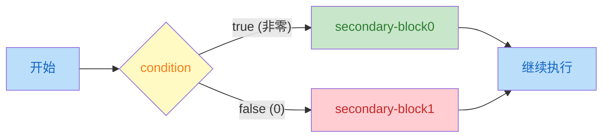
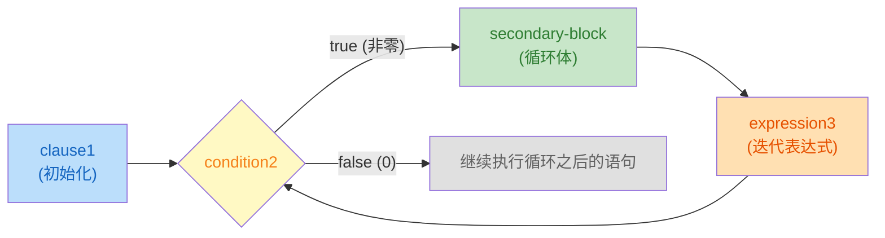
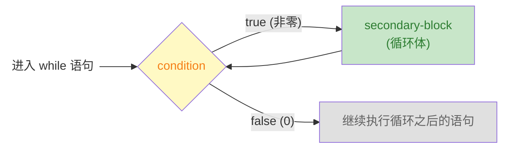
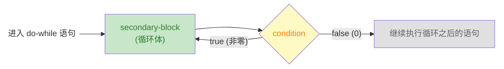

# 控制语句

C 语言中的一切都是为了 **控制** 程序的执行流。下面将要介绍的控制语句包括

+ **选择语句**: `if` 语句和 `switch` 语句允许程序在一组可选项中选择一条特定的执行路径
+ **迭代语句**: `while` 语句 `do-while` 语句 和 `for` 语句支持重复执行某项操作
+ **跳转语句**: `break` 语句 `continue` 语句 和 `goto` 语句将控制执行流跳转到程序中的某个位置

程序的整个执行流程由这些语句进行组织。下面我们从 `if` 语句开始

## 条件执行

我们将看到的第一个结构由关键字 `if` 指定。它根据 `(...)` 中条件表达式的值从两个可选的代码路径中选择一个

```c
if (condition) secondary-block0 else secondary-block1
```

下图演示了 `if` 语句是如何执行的



当执行流进入 `if` 语句时，首先计算 `condition` 表达式；如果该表达式的值是 `true`，则执行 `secondary-block0` 程序块；否则，执行 `secondary-block1` 程序块。例如

```c
if (i > 25) {
    j = i - 25;
} else {
    j = i;
}
```

当 `i > 25` 的值是 `true` 时，则执行 `j = i - 25`；否则执行 `j = i`。

> [!TIP]
> `if` 语句的 `condition` 部分控制 `if` 语句从 `secondary-block0` 和 `secondary-block1` 两个程序块中选择一个执行。因此，`condition` 表达式也称为 **控制表达式**；`secondary-block0` 和 `secondary-block1`  称为 **依赖块**

在 `if (....) ... else ...` 结构中，`else` 子句是可选的。最简单的 `if` 语句形式如下

```c
if (condition) secondary-block
```

> [!TIP]
> 在 C 语言中，`if` 语句可选的控制表达式非常多。它们可以从简单的比较到非常复杂的嵌套表达式，我们将在 [表达式](expressions.md) 中介绍所有可用的控制表达式
>
> 现在，我们只需要了解两条非常简单且重要的规则
>
> + **零值表示的逻辑值为假**: 任意基本类型的零值被视为 `false`
> + **非零值表示的逻辑值为真**: 任意基本类型的非零值被视为 `true`

下表列出了不同基本类型的零值

| 类别      | 类型                | 零值写法         |
| ----------| ------------------- | ---------------- |
| **布尔**  | `bool`              | `false`          |
| **字符**  | `char`              | `'\0'`           |
|           | `signed char`       | `0`              |
|           | `unsigned char`     | `0`              |
| **整数**  | `short`             | `0`              |
|           | `unsigned short`    | `0`              |
|           | `int`               | `0`              |
|           | `unsigned int`      | `0U`             |
|           | `long`              | `0L`             |
|           | `unsigned long`     | `0UL`            |
|           | `long long`         | `0LL`            |
|           | `unsigned long long`| `0ULL`           |
| **浮点**  | `float`             | `0.0F`           |
|           | `double`            | `0.0`            |
|           | `long double`       | `0.0L`           |
| **指针**  | 任意指针类型        | `NULL` / `0` / `nullptr`(C23) |

这些基本类型我们会在 [基本值和数据](basic-types.md) 中详细讲解。基本类型的变量通常只能保存单一数据项；这种只能保存单一数据项的类型称为 **标量类型**。任意一个标量类型都有一个 **真值**(逻辑值)。

运算符 `==` 和 `!=` 允许我们分别测试两个值是否相等。如果 `a` 的值等于 `b` 的值，则 `a == b` 为真，否则为假；反之，如果 `a` 等于 `b`，则 `a != b` 为假，否则为真。现在，我们直到标量是如何作为条件计算的，我们可以避免冗余。例如

```c
if (i != 0) {
    ....
}
```

可以直接写为

```c
if (i) {
    ....
}
```

### bool 类型(C23)

从 C23 标准提供了 `bool` 类型，并且 `true` 和 `false` 都关键字，用于表示 `bool` 类型的字面值。从技术上讲，`true` 是 $1$ 的别名，`false` 是 $0$ 的别名。然而，使用 `true` 和 `false` 而不是数字，可以强调某个值被解释为一个条件。显然，`bool` 类型的值就是用在 `if` 的控制表达式之上的


> [!WARNING]
> 注意: 一般情况下，零值、`true` 和 `false` 都可以直接表示条件；不应该在和它们进行任何比较
>
> 冗余比较很快就变得不可读，并使代码变得混乱。如果你有一个依赖于真值的条件，那么就直接使用这个真值作为条件。例如
>
> ```c
> bool b = ...;
> if ((b != false) == true) {
>     ....
> }
> ```
>
> 可以写成
>
> ```c
> bool b = ...;
> if (b) {
>     ...
> }
> ```

### 嵌套的 if 语句

C 标准对 `if` 语句的依赖块中的语句没有任何限制，它甚至可以是另一个 `if` 语句。例如，我们想要找出三个数中的最大值，并将其存储在 `max` 中，我们可以像下面一样书写 `if` 语句

```c
if (i > j) {
    if (i > k) {
        max = i;
    } else {
        max = k;
    }
} else {
    if (j > k) {
        max = j;
    } else {
        max = k;
    }
}
```

请注意，`if` 语句的 `secondary-block` 可以只是一条语句，在这种情况下，就不需要使用花括号将其包围起来。例如

```c
if (i > j)
    if (i > k)
        max = i;
    else
        max = k;
else
    if (j > k)
        max = j;
    else
        max = k;
```

请注意，我们将每个 `else` 与它匹配的 `if` 对其排列，以提高可读性。但是依旧**不建议像这样省略花括号**。

> [!WARNING]
> 缺少花括号的情况下，一定要小心悬空的 `else` 子句问题。例如
>
> ```c
> if (y != 0)
>     if (x != 0)
>         result = x / y;
> else
>     printf("Error: y is equal to 0\n");
> ```
>
> 这里的 `else` 的缩进暗示它属于外层的 `if` 语句。然而，C 语言遵循的规则是 `else` 子句应该属于离它最近且还没有和其他 `else` 匹配的 `if` 语句。因此，这个示例代码片段的 `else` 子句应该属于内层的 `if` 语句。正确的缩进格式应该是
>
> ```c
> if (y != 0)
>     if (x != 0)
>         result = x / y;
>     else
>         printf("Error: y is equal to 0\n");
> ```
>
> 如果 `if` 语句的每个依赖块都使用花括号包围起来，就不会出现这样的悬空 `else` 问题
>
> ```c
> if (y != 0) {
>     if (x != 0)
>         result = x / y;
> } else {
>     printf("Error: y is equal to 0\n");
> }
> ```

### 级联的 if 语句

有时候我们需要从一系列的条件中选择其中一个条件执行。例如

```c
if (n < 0) {
    printf("n is less than 0\n");
} else {
    if (n == 0) {
        printf("n is equal to 0\n");
    } else {
        printf("n is greater than 0\n");
    }
}
```

这里我们将第二个 `if` 语句放在了第一个 `if` 语句的 `else` 依赖块中；如果还有其他的可选条件，就需要将其放在第二个 `if` 语句的 `else` 依赖块中，以此类推下去，这样会带来嵌套灾难。由于每个 `if` 的 `else` 依赖块只嵌套了另一个 `if` 语句，因此，省略 `else` 依赖块的花括号并重新安排一下 `else` 块就得到

```c
if (n < 0) {
    printf("n is less than 0\n");
} else if (n == 0) {
    printf("n is equal to 0\n");
} else {
    printf("n is greater than 0\n");
}
```

这种形式的 `if` 语句称为级联式 `if` 语句；请注意，这并不是一个新语句，它仅仅是普通的 `if` 语句，只是碰巧另外一条 `if` 语句作为 `else` 子句的依赖块而已

### 示例程序: 计算股票经纪人的佣金

当股票通过经纪人进行买卖时，经纪人的佣金往往根据股票交易额采用某种变化的比例进行计算，下表列出了实际支付给经纪人的费用金额

| 交易额范围            | 佣金              |
| --------------------- | ----------------- |
| 低于 2500 美元        | 30 美元 + 1.7%    |
| 2500 ~ 6250 美元      | 56 美元 + 0.66%   |
| 6250 ~ 20 000 美元    | 76 美元 + 0.34%   |
| 20 000 ~ 50 000 美元  | 100 美元 + 0.22%  |
| 50 000 ~ 500 000 美元 | 155 美元 + 0.11%  |
| 超过 500 000 美元     | 255 美元 + 0.09%  |

经纪人的最低收费是 $39$ 美元。编写程序，要求用户输入交易金额，并输出股票经纪人的佣金

```c title="broker.c" linenums="1"
/* broker.c - 计算股票经纪人的佣金 */
#include <stdio.h>

int main(void) {

    double commission = {}; // 佣金
    double value = {};      // 交易金额

    printf("Enter value of trade: ");
    scanf("%lf", &value);

    if (value < 2'500.0) {
        commission = 30 + 0.017 * value;
    } else if(value < 6'250.0) {
        commission = 56 + 0.0066 * value;
    } else if (value < 20'000.0) {
        commission = 76 + 0.0034 * value;
    } else if (value < 50'000.0) {
        commission = 100 + 0.0022 * value;
    } else if (value < 500'000.0) {
        commission = 155 + 0.0011 * value;
    } else {
        commission = 255 + 0.0009 * value;
    }

    if (commission < 39.0) {
        commission = 39.0;
    }

    printf("Commission: %.2lf\n", commission);
    return 0;
}
```

<details>
<summary><strong>NOTE: 编译并运行</strong></summary>

> [!NOTE]
> ```shell
> ➜ gcc -Wall -std=c23 -o broker broker.c
> ➜ ./broker
> Enter value of trade: 34657
> Commission: 176.25
> ```

</details>

## 循环

**循环语句** 控制程序执行流重复执行其他语句。C 语言提供 $3$ 中循环结构，每种循环结构都有一个 **控制表达式**。每次执行循环体时都需要对控制表达式进行求值；如果控制表达式的值为 `true`，则继续执行；否则结束循环。

一个完整的 `for` 语句应该是如下形式的

```c
for (clause1; condition2; expression3) secondary-block
```



其中 `clause1` 是一个赋值表达式或循环变量的定义语句，它用于声明循环变量的初始值；`condition2` 是 `for` 语句的控制表达式，在执行 `secondary-block`(**依赖块**) 之前会计算控制表达式的值从而决定是否执行它；`expression3` 用于修改 `clause1` 中使用的循环变量，它在每次 `secondary-block` 执行结束时执行。


> [!TIP]
> + 通常，我们希望在 `for` 循环的上下文中严格定义循环变量，所以大多数情形下，`clause1` 应该是一个变量定义语句
> + `for` 循环由 $4$ 个部分组成，相对比较复杂；因此，`secondary-block` 应该是由 `{...}` 包围的程序块

下面的 $3$ 条语句是 `for` 语句的惯例用法

```c
// 第一个 `for` 语句 `i` 从 10 减到 1。条件仍然使用变量 `i` 的值
// 不需要针对值 0 进行多余的测试。当 `i` 变为 0 时，它将被计算为 `false`
// 循环停止
for (size_t i = 10; i; --i) {
    // 语句
}

// 第二个 `for` 语句声明了两个变量 `i` 和 `stop`。当 i 大于或等于 stop 时，循环终止
for (size_t i = 0, stop = upper_bound(); i < stop; ++i) {
    // 语句
}

// 第三个 `for` 语句看起来会一直走下去，但实际上是从 9 减少到 0。
// 当 i 为 0 时，再次减 1 就会触发无符号整数的算术溢出，从而发生回绕
// 此时 i 的值变为 SIZE_MAX(size_t 类型的最大值)
for (size_t i = 9; i <= 9; --i) {
    // 语句
}
```

> [!TIP]
> `size_t` 类型是 C 语言中的一种语义类型，它表示了数量和大小的概念，这种类型永远不会为负数

在 C 语言中，还有两个循环语句 `while` 和 `do-while`:

```c
while (condition) secondary-block
do secondary-block while (condition);  // 注意，这里的分号(;)是必不可少的
```

这两个循环语句的唯一区别就是在 `condition` 控制表达式的值为 `false` 时，`while` 语句的 `secondary-block`(依赖块) 根本不会执行，而 `do-while` 语句的 `secondary-block`(依赖块) 会在 `do-while` 语句终止之前执行一次。





<details>
<summary><strong>TIP: 牛顿迭代法</strong></summary>

> [!TIP]
> 牛顿迭代法是由牛顿在 17 世纪提出的求解方程的数值方法；即 对于在 $[a, b]$ 上连续且单调的函数 $f(x)$，求方程 $f(x)=0$ 的近似解
>
> 任意选取一个函数 $f(x)$ 上的一点 $(x_{n}, f(x_{n}))$，在这个点上进行一阶泰勒展开
>
> $$
> f(x) \approx f(x_{n}) + f^{\prime}(x_{n})(x - x_{n})
> $$
>
> 令 $f(x) = 0$，代入近似公式，求解 $x$
>
> $$
> \begin{aligned}
> 0 &= f(x_{n}) + f^{\prime}(x_{n})(x - x_{n})\\
> x - x_{n} &= - \frac{f(x_n)}{f^{\prime}(x_n)} \\
> x &= x_{n} - \frac{f(x_n)}{f^{\prime}(x_n)}
> \end{aligned}
> $$
>
> 将此时解出的 $x$ 记为下一次迭代的近似值 $x_{n+1}$。从几何上来讲，$x_{n+1}$ 就是过 $(x_{n}, f(x_{n}))$ 点的切线与 $x$ 轴的交点

</details>

下面的示例展示了 `while` 语句的典型用法。它实现了所谓的牛顿迭代法来计算一个数 $a$ 的倒数 $\frac{1}{a}$

<details>
<summary><strong>NOTE: 牛顿迭代法计算数 $x$ 的倒数 $\frac{1}{x}$</strong></summary>

> [!NOTE]
> 想要计算 $y = \frac{1}{x}$ 的值，就可以转化为求解方程
>
> $$
> f(y) = \frac{1}{y} - x = 0
> $$
>
> 其导数为
>
> $$
> f^{\prime}(y) = -\frac{1}{y^2}
> $$
>
> 代入牛顿迭代公式得到
>
> $$
> \begin{aligned}
> y_{n+1} &= y_{n} - \frac{f(y_n)}{f^{\prime}(y_n)} \\
>         &= y_{n} - \frac{\frac{1}{y_{n}} - x}{-\frac{1}{y_{n}^2}} \\
>         &= y_{n} + y_{n}^{2} \cdot (\frac{1}{y_{n}} - x) \\
>         &= y_{n} + y_{n} - x \cdot y_{n}^2 \\
>         &= y_{n} \cdot (2 - x\cdot y_{n})
> \end{aligned}
> $$

</details>

```c
double const eps = 1E-9;  // 精度

double const a = 34.0;
double x = 0.5;          // 猜测的第一个值
while (fabs(1.0 - a * x) >= eps) {
    x *= (2.0 - a * x);  // 牛顿迭代法
}
```

只要给定条件的计算结果为 `true`，它就会继续循环。也可以使用 `do-while` 语句实现

```c
do {
    x *= (2.0 - a * x);  // 牛顿迭代法
} while (fabs(1.0 - a * x) >= eps);
```

C 语言还提供了 `break` 和 `continue` 语句；它们可以使得这 3 个循环语句变得更加灵活。`break` 会直接 **打断** 它所在的循环，即程序执行流离开循环语句，继续执行循环语句后面的其他语句。

```c
while (true) {
    double prod = a * x;
    if (fabs(1.0 - prod) < eps) {
        break;
    }
    x *= (2.0 - prod);
}
```

`continue` 语句的使用频率较低，它跳过依赖块的剩余部分的执行，因此在 `continue` 之后的所有语句都不会在当前循环中执行。但是，`continue` 不会导致循环被打断，而是重新开始计算循环的控制表达式，只要控制表达式的值为 `true`，循环继续执行

```c
for (size_t i = 0; i < max_iterations; ++i) {
    if (x > 1.0) {  // 检查 x 是否大于 1
        x = 1.0 / x;
        continue;
    }
    double prod = a * x;
    if (fabs(1.0 - prod) < eps) {
        break;
    }
    x *= (2.0 - prod);
}
```

### 示例程序: 显示平方表

这个示例程序允许用户输入一个数字 $n$，然后显示 $n$ 行输出，每行包含一个 $1 \sim n$ 的数及其平方值

```c title="square.c" linenums="1"
/* square.c - 显示平方表 */
#include <stdio.h>

int main(void) {
    int number = {};

    printf("Enter number of entries in table: ");
    scanf("%d", &number);

    int i = 1;
    while (i <= number) {
        printf("%10d%10d\n", i, i * i);
        ++i;
    }

    return 0;
}
```

<details>
<summary><strong>NOTE: 编译并运行</strong></summary>

> [!NOTE]
> ```shell
> ➜ gcc -Wall -std=c23 -o square square.c
> ➜ ./square
> Enter number of entries in table: 12
>         1         1
>         2         4
>         3         9
>         4        16
>         5        25
>         6        36
>         7        49
>         8        64
>         9        81
>         10       100
>         11       121
>         12       144
> ```

</details>

### 示例程序: 计算整数的位数 

这个示例程序允许用户输入一个整数，程序将输出整数的位数是多少

```c title="numdigit.c" linenums="1"
/* numdigit.c - 计算整数的位数 */
#include <stdio.h>

int main(void) {

    int number = {};

    printf("Enter an integer number: ");
    scanf("%d", &number);

    int digits = {};

    do {
        number /= 10;
        ++digits;
    } while (number != 0);

    printf("The number has %d digit(s).\n", digits);

    return 0;
}
```

<details>
<summary><strong>NOTE: 编译并输出</strong></summary>

> [!NOTE]
> ```shell
> ➜ gcc -Wall -std=c23 -o numdigit numdigit.c
> ➜ ./numdigit
> Enter an integer number: 0
> The number has 1 digit(s).
> ➜ ./numdigit
> Enter an integer number: 789
> The number has 3 digit(s).
> ➜ ./numdigit
> Enter an integer number: -90
> The number has 2 digit(s).
> ```

</details>

### 示例程序: 改进的平方表 

该示例程序是程序 `square.c` 的改进版本；程序 `square.c` 在计算平方表时直接使用的乘法运算符。计算机在计算乘法时需要消耗的时间通常要比计算加法消耗的时间更长

> [!TIP]
> 为了计算 $n^2$，我们首先观察一下 $(n-1)^2$
>
> $$
> (n-1)^2 = n^2 - 2n + 1
> $$
>
> 调整一下，我们就得到了
>
> $$
> n^2 = (n-1)^2 + (2n - 1)
> $$

```c title="square2.c" linenums="1"
/* square2.c - 改进的平方表计算方法 */
#include <stdio.h>

int main(void) {
    int number = {0};

    printf("Enter an integer number: ");
    scanf("%d", &number);

    if (number < 0) {
        number = -number;
    }

    for (int i = 1, square = 1, odd = 1; i <= number; ++i, odd += 2, square += odd) {
        printf("%10d%10d\n", i, square);
    }

    return 0;
}
```

### 示例程序: 计算 $x^m$ 

计算一个数 $x$ 的 $m$ 次幂最简单的方式就是直接将 $x$ 乘以 $m$ 次。但是，当 $m$ 较大时，程序需要连续计算 $m$ 次乘法。为了减少乘法的计算量，我们关注 $m$ 的二进制表示。假设 $m = 13$ 其二进制表示为 $m=(1101)_2$，因此，我们有

$$
x^{13} = x^{2^3+2^2+2^0} = x^{2^3}\cdot x^{2^2} \cdot x^{2^0}
$$

这个算法可以这样进行下去

+ 初始化结果 `res = 1`，底数 `base = x`，指数 `m = 13`。
+ 循环直到 `m = 0`
    + 如果 `m & 1 == 1`，则 `res *= base`
    + `base = base * base` （平方）
    + `m >>= 1` （右移一位）

```c title="power.c" linenums="1"
/* power.c - 快速幂 */
#include <stdio.h>
#include <stdlib.h>

int main(int argc, char* argv[argc + 1]) {
    if (argc != 3) {
        fprintf(stderr, "Usage: %s <base> <exp>", argv[0]);
        return EXIT_FAILURE;
    }

    double base = strtod(argv[1], nullptr);
    int exp = (int)strtol(argv[2], nullptr, 10);

    if (exp < 0) {
        base = 1 / base;
        exp = -exp;
    }

    double result = 1.0;

    while (exp != 0) {
        if ((exp & 0x1) == 1) {
            result *= base;
        }
        base *= base;
        exp >>= 1;
    }

    printf("Result is: %.2g\n", result);

    return EXIT_SUCCESS;
}
```

<details>
<summary><strong>NOTE: 编译并运行</strong></summary>

> [!NOTE]
> ```shell
> ➜ gcc -Wall -std=c23 -o power power.c
> ➜ ./power 2 10
> Result is: 1e+03
> ➜ ./power 2 -2
> Result is: 0.25
> ➜ ./power -2 2
> Result is: 4
> ➜ ./power -2 -2
> Result is: 0.25
> ```

</details>

## 多重选择

C 语言提供的最后一个控制语句是 `switch` 语句，它是另外一种 **选择** 语句，主要用于解决级联式 `if` 结构过于烦琐的情况

```c
if (grade == 4) {
    printf("Excellent");
}
else if (grade == 3) {
    printf("Good");
}
else if (grade == 2) {
    printf("Average");
}
else if (grade == 1) {
    printf("Poor");
}
else if (grade == 0) {
    printf("Failing");
}
else {
    printf("Illegal grade");
}
```

使用 `switch` 语句可以将上述语句简化为

```c
switch (grade)  {
  case 4:   printf("Excellent");
            break;
  case 3:   printf("Good");
            break;
  case 2:   printf("Average");
            break;
  case 1:   printf("Poor");
            break;
  case 0:   printf("Failing");
            break;
  default:  printf("Illegal grade");
            break;
}
```

这里，我们根据 `grade` 变量的值选择一个 `printf` 调用。`switch` 语句在执行时，变量 `grade` 的值与 `4` `3` `2` `1` 和 `0` 进行比较。如果 `grade` 和其中一个值匹配（例如，与 `4` 匹配），那么显示信息 `"Excellent"`，然后 `break` 语句将程序的控制流转移到 `switch` 语句后面的其他语句。如果 `grade` 的值与所有的情况(`case label`) 都不匹配，那么执行 `default` 分支的语句

从语法上讲，`switch` 非常简单

```c
switch (expression) secondary-block
```

其中 `secondary-block` 是一系列的 `case label:`，它们将作为 **跳转目标**。根据 `expression` 的值，控制在标签对应的语句处继续执行。如果碰到 `break` 语句，它后面的所有 `switch` 都会终止，控制转移到 `switch` 之后的下一条语句。将 `switch` 语句写详细一点就是

```c
switch(expression) {
    case ICE: statements
    ....
    case ICE: statements
    default: statements
}
```

其中 `ICE` 称为 **整数常量表达式**；也就是说，`expression` 必须是整数类型的表达式。`statements` 是每个标签需要执行的语句序列，这里是 C 程序中少数几个不需要花括号的地方；每组语句的最后一条通常是 `break` 语句

> [!WARNING]
> 下面的例子就说明这个问题
>
> ```c
> int test = {3};
> switch (test) {
>
>     int i = {1};  // 非法的 case 标签绕过了它的定义进入了它的作用域
>
>     case 1:
>         int j = {2}; // 非法的
>         break
>     case 3: {
>
>         int m = {4}; // OK
>     }
>
>     default:
>         int n = {5}; // OK: 如果 default 后面还有其他标签，这也是非法的
> }
> ```

