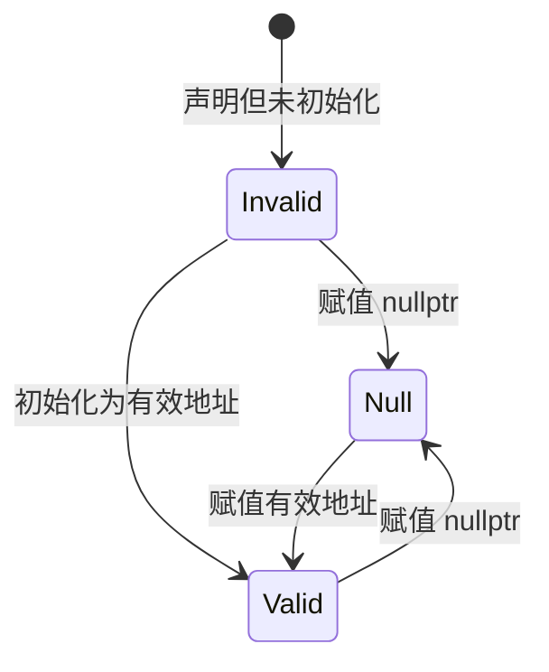

# 派生类型

在 C 语言中的所有其他数据类型都是从 [基本类型](basic-types.md#基本类型) 中派生出来的。派生数据类型有四种策略。下表列出了 C 语言中的 $4$ 种派生类型

| 派生类型 | 描述                 |
| :------- | :------------------- |
| 数组     | 同类型对象的集合     |
| 指针     | 指向内存中对象的实体 |
| 结构体   | 不同类型对象的组合   |
| 联合体   | 共享内存的多类型     |
| 枚举     | 命名整数常量         |
| typedef  | 类型别名             |

其中，枚举我们在 [基本值和数据#命名常量](./basic-types.md#命名常量) 中已经介绍过了，这里不在赘述。联合体涉及 C 语言中内存布局，我们留在 [C 语言内存模型](memory-model.md) 中介绍。指针是 C 语言中最复杂的概念，我们推迟到 [指针](pointer.md) 中介绍

现在，我们从数组开始吧

## 数组

数组是**相同类型**对象的**有序**集合，存储在一段连续的内存中，数组表示的就是一段连续的内存。

> [!TIP]
> 换句话说，**数组本身也是一个对象**。也就是说，数组允许我们将相同类型的对象分组到一个封装对象中

声明数组也非常简单，只需要在普通变量声明的后面加上 `[N]` 即可。例如

```c
int arr[5] = {10, 20, 30, 40, 50};
```

其中 `int` 数组元素的类型；`[N]` 表示标识符 `arr` 是一个长度为 $N$ 的数组。本例中，数组 `arr` 的内存布局如下

```
地址:   0x1000  0x1004  0x1008  0x100C  0x1010
        +-------+-------+-------+-------+-------+
值:     |  10   |  20   |  30   |  40   |  50   |
        +-------+-------+-------+-------+-------+
索引:     [0]     [1]     [2]     [3]     [4]
```

> [!TIP]
> 对于每个 `int` 类型对象占 $4$ 字节的平台上，所有相邻元素地址相差 $4$

组成数组的类型本身也可以是数组，从而形成 **多维数组**。因为 `[]` 与**左边绑定**，所以这些声明读起来有点困难。下面两个声明声明了类型完全相同的变量

```c
double C[M][N];
double (D[M])[N];
```

根据做 **左绑定规则**，我们必须按照从内到外的顺序读嵌套的数组声明来描述其结构。也就是说，标识符 `C` 和 `D` 都是长度为 $M$ 的数组，元素类型是 `double[N]`

在 C 语言中，没有所谓的多维数组，本质上就是 **数组的数组**。例如，声明一个 $3$ 行 $4$ 列的二维数组

```c
int matrix[3][4] = {
    {1, 2, 3, 4},
    {5, 6, 7, 8},
    {9, 10, 11, 12},
}
```

在内存中，也是存储在连续地址的内存块中，并且按照 **行优先存储** 的方式。数组 `matrix` 的内存布局为

```
[1][2][3][4][5][6][7][8][9][10][11][12]
|-- 第0行 --|-- 第1行 --|---- 第2行 ---|
```

### 初始化

在 C 语言中，数组的初始化使用 `{...}` 形式的初始化列表，数组的每个元素依次使用初始化列表中的元素进行初始化

```c
int a[5] = {1, 2, 3, 4, 5};
// a[0]=1 a[1]=2 a[2]=3 a[3]=4 a[4]=5
```

如果初始化列表中的元素数量小于数组的长度，则剩余元素被编译器初始化为类型的 **零值**

```c
// 部分初始化，剩余元素自动为 0
int b[5] = {1, 2};        // {1, 2, 0, 0, 0}
```

> [!tip]
> 利用这个特性，可以很容易将数组的元素全部初始化为 $0$。
>
> ```c
> int b[5] = {0};  // 数组元素全部初始化为 0
> ```
>
> 从 C23 标准开始，允许直接使用空初始化列表表示将对象初始化为类型的零值
>
> ```c
> int b[5] = {};  // 数组元素全部初始化为 0
> ```

如果提供了初始化列表，数组的长度信息完全可以由编译器从初始化列表中计算的到；此时，可以省略数组长度

```c
// 让编译器推断大小
int c[] = {1, 2, 3};      // 大小自动为 3
```

### 数组操作

再次强调，**数组只是另一种类型的对象**。但是，数组与普通对象存在一些差异。大多数对象运算符不能将数组作为对象操作数

> [!TIP]
> 因为这些对象运算符 **要么假定了算术运算**，要么是因为它们 **有第二个值操作数**，这个操作数也必须是一个数组

在 C 语言的所有对象运算符中，仅有 $4$ 个运算符可以作为对象运算符在数组上使用

| 运算符                | 描述               |
| :-------------------- | :----------------- |
| `[]`                  | 数组下标           |
| `&`                   | 获取数组的地址     |
| `sizeof`              | 计算数组对象的大小 |
| `array`(单纯的数组名) | 数组衰减运算       |

#### 数组下标

为了存取特定的数组元素，可以在写数组名的同时在后面加上 `[index]` 存取 **索引** 为 `index` 的数组元素

数组的每一个元素都有一个唯一的整数进行编号，这个编号称为数组元素的 **索引**。在 C 语言中，数组元素的索引可以理解为 **到首元素的距离**；因此，数组元素的索引始终从 $0$ 开始，最后一个元素的索引是 $N-1$，这里的 $N$ 是数组的长度

```c
int arr[5] = {10, 20, 30, 40, 50};

arr[0]   // 10 — 第一个元素
arr[4]   // 50 — 最后一个元素
arr[5]   // ❌ 未定义行为！越界访问
```

> [!WARNING]
> **C 语言不检查数组越界**。访问 `arr[5]`（大小为 $5$ 的数组）不会报编译错误，但会导致未定义行为——这是 C 程序最常见的 bug 来源之一

#### 示例程序： 检查数中重复出现的数字

这个示例程序要求用户输入一个十进制整数，示例程序会检查这个整数中是否存在重复的数字

```c
/* repdigit.c - 检查数字中是否出现重复数字 */
#include <stdio.h>

constexpr size_t BASE = 10;

int main(void) {
    int number = {};
    size_t digits[BASE] = {};  // 记录每个基本数字出现的次数

    printf("Enter a number: ");
    scanf("%d", &number);

    // 计算每个数字出现的次数
    do {
        ++digits[number % BASE];
        number /= BASE;
    } while (number != 0);

    printf("Repeated digit:");
    for (size_t i = 0; i < BASE; ++i) {
        // 数字重复出现：次数 > 1
        if (digits[i] > 1) {
            printf(" %zu", i);
        }
    }
    printf("\n");

    return 0;
}
```

<details>
<summary><strong>NOTE: 编译并运行</strong></summary>

```shell
➜ gcc -Wall -std=c23 -o repdigit repdigit.c
➜ ./repdigit
Enter a number: 939575
Repeated digit: 5 9

➜ ./repdigit
Enter a number: 123456
Repeated digit:

➜ ./repdigit
Enter a number: 112233
Repeated digit: 1 2 3
```

</details>

#### 数组长度

C 语言中的数组可以分为两类

| 类别                                 | 特点             |
| :----------------------------------- | :--------------- |
| 定长数组(Constant-Length Array, CLA) | 长度在编译期确定 |
| 变长数组(Variable-Length Array, VLA) | 长度在运行时确定 |

VLA 是 C99 引入的，但 C11 之后变成可选特性。C23 中，VLA 本身对自动变量是可选的（用预定义宏 `__STDC_NO_VLA__` 查询），但 **VLA 的类型** 和 **指向 VLA 的指针** 又变成强制的了。

> [!TIP]
> VLA 不能有使用初始化列表进行初始化

```c
void foo(size_t n) {
    int vla[n] = {0};   // 不允许用非默认初始化列表进行初始化
    int vla2[n];        // 可以声明，但不能初始化
}
```

VLA 的大小在运行时才知道，编译器无法在编译期验证初始化列表的长度是否匹配

> [!TIP]
> VLA 不能再函数外声明

```c
int n = 10;
int arr[n];     // ❌ 如果 n 不是编译期常量，这就是 VLA，不能在全局作用域
```

全局变量在程序启动前就需要分配内存，而 VLA 的大小要运行时才能确定，所以不允许

> [!TIP]
> 定长数组的长度由 ICE 或初始化列表确定

CLA（Constant-Length Array） 的长度来自两种方式之一

1. 整数常量表达式（ICE） — 编译期就能算出来
2. 初始化器 — 编译器从 = `{...}` 推断长度

```c
// 方式 1：ICE
#define N 10
int a[N];                    // ✅ N 是宏，编译期替换
constexpr int M = 5;
int b[M];                    // ✅ C23 中 constexpr 整数是 ICE

// 方式 2：初始化器推断
double E[] = { [3] = 42.0, [2] = 37.0 };  // 长度 = 4
double F[] = { 22.0, 17.0, 1, 0.5 };      // 长度 = 4
```

`E` 的例子用了 **指定初始化器**：`[3] = 42.0` 表示把 `42.0` 放到索引 `3` 的位置。最大的索引是 `3`，所以长度至少是 `4`。


> [!TIP]
> 数组长度必须严格为正。换句话说，数组长度的最小值是 $1$

```C
int a[0];      // ❌ 长度为 0，不允许
int a[-1];     // ❌ 负数，更不行
int a[5];      // ✅
```

这是 C 标准的硬性规定。长度为 $0$ 的数组没有意义（不占据任何元素的空间），GCC 有扩展支持零长数组，但那不是标准 C

> [!TIP]
> 长度不是 ICE 的数组就是 VLA

```c
int n = 10;
int arr[n];      // n 不是 ICE（是变量），所以 arr 是 VLA
```

判断标准很简单：**长度表达式能否在编译期算出来？**

- 能 → CLA
- 不能 → VLA

现在还有一个问题：编译器从初始化列表中推导的数组长期该如何获取呢？这里就是运算符 `sizeof` 发挥作用的时候了。计算数组长度的公式如下

$$\text{length} = \frac{\texttt{sizeof A}}{\texttt{sizeof A[0]}}$$

运算符 `sizeof` 用于获取对象占用的总字节数。因此 `sizeof A` 表示数组 `A` 占用的总字节大小。用总的字节数除以每个元素的大小就可以获得元素的数量；数组元素的大小可以使用 `sizeof A[0]` 获取。

```c
int arr[5] = {1, 2, 3, 4, 5};
size_t len = sizeof arr / sizeof arr[0];   // 20 / 4 = 5
```

> [!TIP]
> `sizeof arr / sizeof arr[0]` 是获取数组元素个数的惯用写法。可以定义为宏：
>
> ```c
> #define SIZE(a) (sizeof(a) / sizeof((a)[0]))
> ```

#### 示例程序：计算利息

程序要求用户输入利率和要投资的年数，每年计算一次价值。程序显示显示一个表格，这个表格显示了在几年时间内 $100$ 美元投资在输入利率和紧随其后的 $4$ 个更高的利率下投资的总价值

```c
/* interest.c - 显示投资价值 */
#include <stdio.h>

// 计算数组的长度
#define SIZE(a) (sizeof(a) / sizeof((a)[0]))

constexpr double BALANCE = 100.00; // 存款

int main(void) {

    int rate = {};      // 利率。按照 100.00 进行缩放。真实利率时 rate / 100
    int years = {};     // 投资年限

    constexpr size_t size = 5;
    double value[size];

    printf("Enter interest rate: ");
    scanf("%d", &rate);
    printf("Enter number of years: ");
    scanf("%d", &years);

    printf("\nYears");
    for (size_t i = 0; i < SIZE(value); ++i) {
        printf("%6zu%%", rate + i);
        value[i] = BALANCE;
    }
    printf("\n");

    // 计算每年的投资价值
    for(int year = 1; year <= years; ++year) {
        printf("%3d   ", year);
        for (size_t i = 0; i < SIZE(value); ++i) {
            // 年复利
            value[i] += (rate + i) / 100.0 * value[i];
            printf("%7.2f", value[i]);
        }
        printf("\n");
    }

    return 0;
}
```

<details>
<summary><strong>NOTE: 编译并运行</strong></summary>

```shell
➜ gcc -Wall -std=c23 -o interest interest.c
➜ ./interest
Enter interest rate: 5
Enter number of years: 8

Years     5%     6%     7%     8%     9%
  1    105.00 106.00 107.00 108.00 109.00
  2    110.25 112.36 114.49 116.64 118.81
  3    115.76 119.10 122.50 125.97 129.50
  4    121.55 126.25 131.08 136.05 141.16
  5    127.63 133.82 140.26 146.93 153.86
  6    134.01 141.85 150.07 158.69 167.71
  7    140.71 150.36 160.58 171.38 182.80
  8    147.75 159.38 171.82 185.09 199.26
```

</details>

### 数组作为参数

当数组作为函数参数时，数组会退化为指向数组首元素的指针。在函数参数中写 `int arr[5]` 时，编译器会直接忽视那个 $5$。下面的 $3$ 中写法完全等价。编译器吧数组参数改写成了指针

```c
void foo(int arr[5]);     // 编译器看到的是：void foo(int *arr);
void bar(int arr[100]);   // 编译器看到的也是：void bar(int *arr);
void baz(int arr[]);      // 编译器看到的还是：void baz(int *arr);
```

对于多维数组参数，**第一维度的信息会丢失**

```c
void foo(int matrix[3][4]);    // 编译器看到的是：void foo(int (*matrix)[4]);
void bar(int matrix[][4]);     // 同上，第一维丢失，第二维保留
void baz(int matrix[100][4]);  // 同上，100 被忽略
```

多维数组作为参数时，只会丢失第一维度的信息，其他维度信息会被保留下来，因为编译器需要它来计算行偏移

由于数组参数被编译器改写为了指针，因此使用 `sizeof` 运算符拿到的是 **指针的大小**，不是数组的大小度。

```c
void foo(int arr[5]) {
    printf("%zu\n", sizeof arr);      // 8（指针大小），不是 20！
    printf("%zu\n", sizeof(arr[0]));  // 4（元素大小），这个没问题
}

int main(void) {
    int a[5] = {1, 2, 3, 4, 5};
    printf("%zu\n", sizeof a);        // 20 ✅ 这里是真正的数组对象
    foo(a);
}
```

> [!WARNING]
> 请注意：计算数组长度的公式 `sizeof arr / sizeof arr[0]` 在函数内部不适用。

下面我来看一个数组作为参数一个例子

```c
void swap_double(double a[static 2]) {
    auto tmp = a[0];
    a[0] = a[1];
    a[1] = tmp;
}

int main(void) {
    double A[2] = {1.0, 2.0};
    swap_double(A);
    printf("A[0] = %g, A[1] = %g\n", A[0], A[1]);  // A[0] = 2, A[1] = 1
}
```

这个例子中的输出是 `A[0] = 2, A[1] = 1`。`swap_double` 直接修改了 `main` 中的数组 `A`，不是修改副本。这跟普通变量完全不同：

```c
void increment(int x) {
    x++;           // 只修改副本，main 中的变量不变
}

void modify_array(int arr[3]) {
    arr[0] = 99;   // 直接修改 main 中的数组！
}
```

> [!TIP]
> 原理其实就是：数组参数退化为指针，传递的是数组首元素的地址，所以函数内部操作的是原数组
>
> 在 [指针](pointer.md) 中会更详细的解释原因


注意 `swap_double` 函数定义中 `[static N]` 语法：这个语法表示 **`a` 指向一个至少有 $2$ 个元素的数组，且 `a` 不能是空指针**

这是一种**契约式编程**：告诉编译器和读代码的人"这个指针保证有效，且至少有 `N` 个元素"。编译器可以利用这个信息做优化和警告。标准库中大量使用这种写法：

```c
size_t strlen(char const s[static 1]);        // s 不能为 NULL，至少 1 个元素
char* strcpy(char target[static 1], char const source[static 1]);
int main(int argc, char* argv[argc+1]);       // argv 至少有 argc+1 个元素
```

既然数组参数会丢失长度信息，正确的做法是**把长度和数组一起传**：

```c
// 写法 1：单独传长度
void process(double arr[], size_t len) {
    for (size_t i = 0; i < len; i++) {
        printf("%g ", arr[i]);
    }
}

// 写法 2：用 static 契约（已知最小长度）
void swap_double(double a[static 2]) {
    // 保证 a 至少有 2 个元素
    double tmp = a[0];
    a[0] = a[1];
    a[1] = tmp;
}

// 写法 3：多维数组，保留内层维度
void print_matrix(int matrix[][4], size_t rows) {
    for (size_t i = 0; i < rows; i++) {
        for (int j = 0; j < 4; j++) {
            printf("%d ", matrix[i][j]);
        }
        printf("\n");
    }
}
```

### 字符串：特殊的字符数组

在 C 语言中，字符串是一个以 `0` 结尾的 `char` 数组。也就是说，C 语言中的"字符串"不是一种独立的数据类型，而是**一种特殊的数组使用方式**：

```c
char hello[] = "hello";
```

看起来只有 $5$ 个字符，但实际上有 $6$ 个元素：

```c
索引:   [0]      [1]      [2]      [3]      [4]      [5]
值:     'h'      'e'      'l'      'l'      'o'      '\0'
```

> [!TIP]
> 最后一个 `'\0'` 就是 **"0 终止符"**（null terminator），它的值就是整数 $0$。所有字符串处理函数都靠找到这个 $0$ 来判断字符串在哪里结束。

与所有数组一样，不能给字符串赋值，但可以通过字符串字面值进行初始化。下面 $4$ 种写法完全等价

```c
char jay0[] = "jay";                    // 方式 1：字符串字面量
char jay1[] = { "jay" };                // 方式 2：花括号包裹的字面量
char jay2[] = { 'j', 'a', 'y', 0, };    // 方式 3：逐字符 + 终止符
char jay3[4] = { 'j', 'a', 'y', };      // 方式 4：部分初始化，剩余为 0
```

注意方式 4：`jay3[4]` 只初始化了前 $3$ 个元素，第 $4$ 个元素(`[3]`)被自动初始化为 $0$，刚好充当终止符

不是所有的 `char` 数组都是字符串。例如，下面两个字符串数组都不是字符串；因为这些字符数组不包含终止符

```c
char jay4[3] = { 'j', 'a', 'y', };     // 没有 '\0'！
char jay5[3] = "jay";                   // 长度不够，'\0' 被截断！
```

> [!WARNING]
> 把字符串函数用于非字符串，会导致程序失败。后果包括
>
> - `strlen` 等扫描函数找不到 $0$，执行时间异常长
> - 越界访问导致段错误（segmentation fault）
> - 数据被写到不该写的地方，导致随机数据损坏

`char` 是一个窄整数类型，用来存储 **基本字符集** 中字符编码值。基本字符集应该包括

+ $26$ 个英文字母(`A-Z` 和 `a-z`)
+ 阿拉伯数字(`0-9`)
+ 标点符号和编程用符号

绝大多数平台使用 **ASCII 编码**。你不需要知道具体的编码数值，C 标准库已经帮你透明处理了

```c
char c = 'A';      // ASCII 值是 65，但你不需要关心
printf("%c\n", c);  // 输出 A
printf("%d\n", c);  // 输出 65
```

### 字符串操作函数

字符串操作函数位于头文件 `<string.h>` 中。这些函数可以分为两个系列的函数：`mem` 系列 和 `str` 系列

下表列出了 $3$ 个 `mem` 函数，它们用于操作 `char` 数组，**不要求** 数组以 `0` 结尾，它们 **靠第三个参数 `len` 来确定操作范围**

| 函数                          | 功能                 | 注意事项                                |
| ----------------------------- | -------------------- | --------------------------------------- |
| `memcpy(target, source, len)` | 复制 `len` 个字节    | target 和 source 必须是**不重叠**的数组 |
| `memcmp(s0, s1, len)`         | 比较两个数组         | 按字典序比较，返回第一个不同元素的差值  |
| `memchr(s, c, len)`           | 在数组中搜索字符 `c` | 找到返回指向该位置的指针                |

以下是 `str` 系列函数，用于操作字符串，要求 `char`数组以 `0` 结束；该系列的函数 **依靠寻找 `'\0'` 终止符控制范围**

| 函数                     | 功能                               | 注意事项                             |
| ------------------------ | ---------------------------------- | ------------------------------------ |
| `strlen(s)`              | 返回字符串长度                     | 不包含 `'\0'`，扫描到 `0` 为止       |
| `strcpy(target, source)` | 复制字符串                         | source 必须是字符串，target 必须够大 |
| `strdup(source)`         | 复制字符串（动态分配内存）         | 需要 `free()` 释放，C23              |
| `strndup(source, len)`   | 复制最多 `len` 个字符              | C23                                  |
| `strcmp(s0, s1)`         | 比较两个字符串                     | 按字典序，遇到 `0` 停止              |
| `strcoll(s0, s1)`        | 比较（考虑语言环境）               | 尊重 locale 设置                     |
| `strchr(s, c)`           | 搜索字符 `c`                       | 类似 `memchr`，但要求字符串          |
| `strspn(s0, s1)`         | 返回 s0 开头在 s1 中出现的字符数   | 用于解析                             |
| `strcspn(s0, s1)`        | 返回 s0 开头不在 s1 中出现的字符数 | 用于解析                             |

## 指针作为不透明类型

这是正式学习 [指针](pointer.md) 的前菜，它提供指针的第一印象：指针能做什么，但不解释为什么

最核心的问题就是回答 **指针和数组的区别**。先看两个声明

```c
char const*const p2string = "some text";    // 指针
char jay[] = "jay";                         // 数组
```

它们存储数组的方式完全不同

```
p2string（指针）              jay0（数组）
    p2string                       [0]       [1]       [2]      [3]
        ↓                       char 'j'  char 'a'  char 'y'  char '\0'
    "some text"                  ↑ 数据直接存储在数组内部
    ↑ 数据在别处，指针只"指向"它
```

> [!TIP]
> 数组**包含**数据，指针**指向**数据。这是两者最本质的区别

**指针是不透明对象**：所谓的 **不透明** 的意思就是你不需要（也无法）知道指针内部是怎么存的。二进制表示完全由平台决定，不是我们该操心的事。我们只能通过 C 语言**运行的操作**来使用指针

+ 初始化
+ 赋值
+ 求值(判断是否为 `nullptr`)
+ ... 剩余的操作我们将在 [指针](pointer.md) 中介绍

指针有三种状态：`valid` `null` 或 `invalid`。下表列出了指针三种状态的含

| 状态                | 含义                     | 可否安全使用           |
| ------------------- | ------------------------ | ---------------------- |
| **valid（有效）**   | 指向一个真实存在的对象   | ✅ 可以                 |
| **null（空）**      | 明确表示"不指向任何东西" | ⚠️ 只能判断，不能解引用 |
| **invalid（无效）** | 未初始化或已释放         | ❌ 危险！               |




使用关键字 `nullptr` 可以使指针变为空

```c
char const*const p2noting = nullptr;

// p2nothing（空指针）
//     ↓
//     ✖  ← 不指向任何东西
```

请注意：**空指针 ≠ 空字符串！**来看下面的示例解释了空指针与空字符串的差异

```c
char const*const p2nothing = nullptr;  // ✖ 不指向任何东西
char const*const p2empty   = "";       // → 指向一个包含 '\0' 的有效字符串

// p2nothing                          p2empty
//     ↓                                  ↓
//     ✖                                 ""
//                                        ↑ 有效！只是长度为 0
```

> [!TIP]
> `nullptr` 是 C23 引入的关键字。在此之前，用 `NULL`（一个宏）。推荐使用 `nullptr`：
>
> ```c
> char const*const p = nullptr;    // ✅ C23 推荐
> char const*const q = NULL;       // ⚠️ 老写法，仍然合法
> ```

空指针在逻辑表达式中为 `false`

```c
char const*const p2str = "hello";
char const*const p2null = nullptr;

if (p2str)    { /* ✅ 进入 — 有效指针为 true */ }
if (!p2null)  { /* ✅ 进入 — 空指针为 false */ }
```

> [!WARNING]
> 这个测试**无法区分有效指针和无效指针**。无效指针的值是不确定的，可能是任意非零值，在 `if` 中也可能为 `true` — 但使用它是未定义行为
>
> 无效指针是非常危险的，因为
>
> + 无法通过 `if (p)` 检测出来
> + 使用它会导致未定义行为（段错误、数据损坏等）

无效指针指向的对象可能不是我期望使用的对象。解引用无效指针往往会导致程序崩溃

```c
char const*const p2invalid;    // 未初始化 → 状态不确定
printf("%s\n", p2invalid);     // ❌ 未定义行为！可能段错误
```

在编写程序时，如果需要声明指针变量，那么应该立即进行初始化。如果不清楚指针应该指向何处，那么 `nullptr` 就非一个非常不错的选择。下面是关于指针的一些最佳实践

```c
// ✅ 好习惯：声明时就初始化
int *p = nullptr;
char const*const msg = "hello";
double *data = malloc(n * sizeof *data);

// ❌ 坏习惯：先声明，后赋值（中间窗口可能误用）
int *p;
... 很多行代码后 ...
p = &some_variable;
```

## 结构

数组将几个类型相同的对象组合成一个更大的对象，使用下标 `[0]`, `[1]` ... 访问。但问题是

+ 如果你想组合**不同类型**的对象，数组做不到
+ 用下标访问语义不清晰。例如，`data[3]` 是什么意思？是年？是月？得靠人脑记忆

**结构**解决上述两个问题：用 `struct` 关键字引入，成员有**名字**和各自的**类型**。例如，下面的代码定义结构类型

```c
struct birdStruct {
    char const* jay;
    char const* magpie;
    char const* raven;
    char const* chough;
};
```

> [!TIP]
> 这只是**类型声明**，不是变量定义。就像你写 `int`; 不会创建一个变量一样，`struct birdStruct { ... }`; 只是告诉编译器："存在这样一种类型，它有四个 `char const*` 成员。"

在 `struct birdStruct {....}` 类型声明中，`birdStruct` 称为**结构标记**。后续可以通过 `struct + 结构标记` 的形式找到这个结构类型。例如，下面的代码声明了结构类型的变量并进行的初始化

```c
struct birdStruct const aName = {
    .chough = "Henry",
    .raven  = "Lissy",
    .magpie = "Frau",
    .jay    = "Joe",
};
```

> [!TIP]
> 关键语法：`.成员名 = 值`，称为 **结构指示器初始化**

变量 `aName` 的内存布局如下：请注意，**结构成员里存的是指针，字符串本身在结构外面**。

```
aName
├── .jay     → "Joe"
├── .magpie  → "Frau"
├── .raven   → "Lissy"
└── .chough  → "Henry"
```

访问结构成员需要使用结构成员运算符(`.`)。例如，需要输出 `raven` 成员的值

```c
printf("%s\n", aName.raven);  // 输出 "Lissy"
```

`aName.raven` 就像一个普通的 `char const*` 变量，可以用在任何表达式里。

在 C 标准库 `<time.h>` 中有一个结构的经典例子 `struct tm`

```c
struct tm {
    int tm_sec;    // 秒 [0, 60]
    int tm_min;    // 分 [0, 59]
    int tm_hour;   // 时 [0, 23]
    int tm_mday;   // 日 [1, 31]
    int tm_mon;    // 月 [0, 11]  ← 注意：从0开始！
    int tm_year;   // 年（自1900起）
    int tm_wday;   // 星期几 [0, 6]
    int tm_yday;   // 一年中第几天 [0, 365]
    int tm_isdst;  // 夏令时标志
};
```

> [!TIP]
> 标准库中 `<time.h>` 的 `struct tm` 的 `tm_year` 成员记录是当前与 `1900` 年的差值。

可以使用下面的方式创建 `struct tm` 类型的对象

```c
struct tm today = {
    .tm_year = 2019 - 1900,
    .tm_mon  = 4 - 1,        // 4月，但要减1
    .tm_mday = 3,
    .tm_hour = 10,
    .tm_min  = 0,
    .tm_sec  = 47,
};
printf("今年是 %d\n", today.tm_year + 1900);
```

结构成员的初始化与数组元素的初始化类似。如果过初始化列表中没有给出相应成员的值，编译器会将成员自动初始化为类型的零值

```c
struct tm t = { .tm_sec = 30 };
// t.tm_min, t.tm_hour, ... 全部是 0
```

与数组不同的是，**结构对象存在值这一概念**。换句话说，当结构作为函数时，结构会进行拷贝(**结构参数按值传递**)

```c
struct tm time_set_yday(struct tm t) {
    t.tm_yday += DAYS_BEFORE[t.tm_mon] + t.tm_mday - 1;
    return t;
}
```

> [!TIP]
> **函数接收的是副本**，修改 `t` 不影响原始对象。要保留修改，必须重新赋值

```C
today = time_set_yday(today);
```

结构可以从另一个结构获得值；换句话说，**结构可以赋值**(也可以用另一个结构初始化)

```c
struct tm a = today;  // 合法，拷贝所有成员
```

> [!WARNING]
> 和数组一样，结构体不能用 `==` 或 `!=` 比较。C 不知道该怎么逐成员比较，你得自己写函数或用 `memcmp`（但要注意 `padding` 问题）。

**结构如何布局是一项重要的设计决策**。一旦代码大量使用了某个结构，改布局就很困难——这是历史包袱。

`struct` 的另一个用途是将**不同类型的对象分组到一个更大的封闭对象中**。同样，对于以纳秒粒度处理时间，C 标准已经做出了这样的选择

```c
struct timespec {
    time_t tv_sec;   // 秒
    long   tv_nsec;  // 纳秒
};
```

> [!NOTE]
> 两个成员类型不同（`time_t` 和 `long`），**用数组无法表达这种"语义不同"的组合**。

### 嵌套结构

结构成员可以**任意类型(VLA 除外)**。因此，结构的成员也可以是另一个结构

```c
struct stardate {
    struct tm date;
    struct timespec precision;
};

struct person {
    char name[256];
    struct stardate bdate;
};
```

对于 `struct person` 类型的变量，其内存布局可能是如下的形态

```
struct person
├── .name[256]         char 数组
└── .bdate             struct stardate
    ├── .date           struct tm
    │   ├── .tm_sec     int
    │   ├── .tm_min     int
    │   └── ...
    └── .precision      struct timespec
        ├── .tv_sec      time_t
        └── .tv_nsec     long
```

当然，C 语言也支持结构类型的嵌套声明，例如

```c
struct person {
    char name[256];
    struct stardate {       // ← 这个声明和 person 同一作用域！
        struct tm date;
        struct timespec precision;
    } bdate;
};
```

> [!WARNING]
> 请注意：C 语言中**嵌套声明不创建新作用域**。C 不像 C++，`struct person` 的 `{}` 不创建新作用域。`struct stardate` 在外层也可见。

在 C 中，结构嵌套不应该是将结构声明置于嵌套结构中。**推荐写法：把所有结构体声明放在同一层级**

```c
struct stardate {
    struct tm date;
    struct timespec precision;
};

struct person {
    char name[256];
    struct stardate bdate;
};
```

### 字段的对齐与合并

#### 字节填充（对齐）

编译器会按照以下规则存储结构变量的成员

+ **顺序存放** — 编译器按字段定义顺序在内存中排列
+ **对齐放置** — 字段会被放在"合适的位置"（通常是其大小的整数倍地址），方便 CPU 按字（word）边界访问。这部分内容会在 [C 内存模型](memory-model.md) 中详细介绍
+ **产生填充** — 对齐会导致字段之间出现未使用的"字节填充"（padding）。注意：**填充总是在成员之后**
+ **填充大小** — 1 到几个字节不等

> [!TIP]
> 编译器为了访问效率，按对齐规则插入填充字节，所以 **结构体实际大小 ≥ 各字段大小之和**。

对齐规则：每种类型有一个**对齐要求**，类型的对齐要求通常就是类型对象占用的字节数。对象的对齐规则是

+ 对象的 **起始地址必须是其对齐值的整数倍**
+ 对象的 **大小也必须是对齐要求的整数倍**

```c
struct Example {
    char a;      // 1 字节
    // 3 字节 padding（对齐到 4 字节边界）
    int b;       // 4 字节
    char c;      // 1 字节
    // 3 字节 padding（总大小对齐到最大成员的对齐要求）
};
// sizeof = 12，不是 6
```

> [!TIP]
> 成员的声明顺序会影响 padding。按大小递减排列可以减少浪费：

重新对 `struct Example` 的成员声明顺序调整后。结构的大小从 $12$ 字节减少到 $8$ 字节，节省了 $4$ 字节的内存

```c
// 优化版本
struct Optimized {
    int b;       // 4
    char a;      // 1
    char c;      // 1
    // 2 字节 padding
};
// sizeof = 8
```

#### 字段合并（位域）

在 `struct tm` 中的每个 `int` 至少占 $16$ 位，但 `tm_sec` 只需要 $6$ 位即可表示 $0 \sim 60$，`tm_isdst` 只需要 $1$ 位。这样出现了大量的空间浪费。**位域可以指定精确的位数**：

```c
struct tib {
    unsigned tib_sec   : 6;   // [0, 60]   — 6 位足够
    unsigned tib_min   : 6;   // [0, 59]   — 6 位足够
    unsigned tib_hour  : 5;   // [0, 23]   — 5 位足够
    unsigned tib_mday  : 5;   // [1, 31]   — 5 位足够
    unsigned tib_mon   : 4;   // [0, 11]   — 4 位足够
    signed   tib_year;        //            — 完整 int
    unsigned tib_wday  : 3;   // [0, 6]    — 3 位足够
    unsigned tib_yday  : 9;   // [0, 365]  — 9 位足够
    unsigned tib_isdst : 1;   // flag      — 1 位足够
};
```

$9$ 个成员从 `9 * sizeof(int)` 降到 `3 * sizeof(int)`，节省 $3$ 倍空间

> [!WARNING]
> 请注意：位域不要使用 `int` 类型。使用 `int` 类型非常危险，因为 `int` 可能是有符号的

```C
// ❌ 危险：int 可能是有符号的，5 位只能存 [-16, 15]
int tib_mday : 5;

// ✅ 明确用 unsigned
unsigned tib_mday : 5;
```

C23 标准引入了 `_BitInt(n)` 类型表示精确位数的整数，非常适合用于声明位域，从而精确控制类型

```c
struct tbi {
    unsigned _BitInt(6) tbi_sec  : 6;
    unsigned _BitInt(6) tbi_min  : 6;
    unsigned _BitInt(5) tbi_hour : 5;
    unsigned _BitInt(5) tbi_mday : 5;
    unsigned _BitInt(4) tbi_mon  : 4;
    signed              tbi_year;
    unsigned _BitInt(3) tbi_wday : 3;
    unsigned _BitInt(9) tbi_yday : 9;
    bool                tbi_isdst: 1;  // flag 用 bool：标志位域用 bool
};
```

## 类型别名（typedef）

结构不仅引入了一种将不同信息聚合到一个单元中的方式，而且还引入了一个新的 **类型名称**。但是出于历史原因，引入结构的名称必须总是出现在 `struct` 关键字之后；如果忘记了 `struct` 关键字，编译器可能无法理解我们的代码。为了解决这样的问题，关键字 `typedef` 可以为类型提供一个 **别名**。


```c
typedef struct birdStruct birdStruct;

struct birdStruct {
    char const* jay;
    char const* magpie;
    char const* raven;
    char const* chough;
};

// 现在 birdStruct 和 struct birdStruct 等价
birdStruct aName = { ... };
```

> [!TIP]
> `typedef` 更重要的能力是 **类型的前向声明**。这是 C 的惯用模式，配合后续介绍的分文件编程可以做到 **隐藏类型的具体实现**

前向声明带来的好处就是结构类型在正式声明时，`typedef` 定义的类型别名就已经存在，可以直接使用了。在自引用结构中，这个特性非常重要

```c
// ✅ 推荐：typedef 在前
typedef struct Node Node;
struct Node {
    int data;
    Node* next;        // ✅ Node 已经是有效类型名了
};

// ⚠️ 也能工作，但不够优雅
struct Node {
    int data;
    struct Node* next;  // 必须写 struct Node*，不能写 Node*
};
typedef struct Node Node;  // typedef 放到后面，之前的代码已经写完了
```

下表对比使用前向声明和不使用前向声明的优缺点

|                    | 方式 A（typedef 在前） | 方式 B（typedef 在后）       |
| ------------------ | ---------------------- | ---------------------------- |
| 能否编译           | ✅                      | ✅                            |
| 结构体内部能用别名 | ✅ `Node* next`         | ❌ 必须写 `struct Node* next` |
| 推荐度             | ⭐ 推荐                 | 能用但不够简洁               |


除了用于结构，`typedef` 机制也可以用于类型。对于数组，它看起来是这样的

```c
typedef double vector[64];  // vector 类型是 double[64] 的别名
typedef vector vecvec[16];  // vecvec 类型是 double[16][64] 的别名

vecvec A;               // A 的类型是 double[16][64]
vector B[16];           // B 的类型也是 double[16][64]
double C[16][64];       // C 的类型也是 double[16][64]
```

类型 `vecvec` 是 `double[16][64]` 的别名别名可能难以理解。现在我们根据 **左绑定规则** 逐层拆解

首先，第一层类型别名：`vector` 等价于 `double[64]`，即 "64 个 double 类型元素的数组"。

```c
typedef double vector[64]
```

然后，详细介绍第二层类型别名

```c
typedef vector vecvec[16];
```

这里我们将 `vector` 还原回去：`vecvec` 等价于 `double[64][16]`，即 "16 个 `double[64]` 类型元素的数组"

```c
typedef double[64] vecvec[16];
```

这样写可以提供更清晰的语句

```c
// typedef 写法：语义清晰
typedef double vector[64];    // 一个向量 = 64 个 double
typedef vector matrix[16];    // 一个矩阵 = 16 个向量

void process(matrix data);    // 显然这是一个矩阵
```

`vector` 是一行（一个向量），`matrix` 是多行组成的矩阵。名字本身就表达了意图。

> [!TIP]
> 从右往左读，`[]` 优先级最高：
>
> ```
> vecvec[16]  →  vecvec 是 [16] 个 ...
> vector      →  ... 是 vector（即 double[64]）
>
> 结果：vecvec = 16 个 double[64] = double[16][64]
> ```
