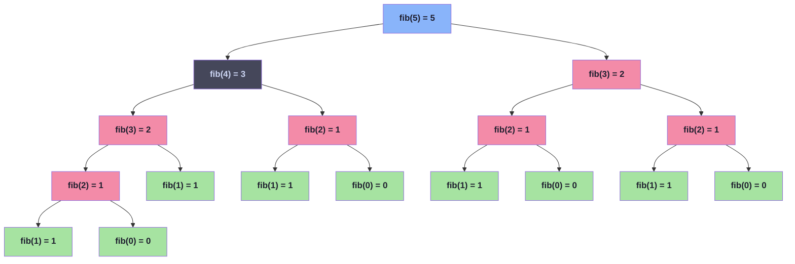

# 函数

我们在 [控制](controls.md) 中介绍了 $5$ 中控制语句，它们都是 **有条件的控制转移**。程序根据运行时的数据选择是否指向某些程序块。函数是另一种形式的控制语句，我们称为 **无条件控制语句**；函数调用不需要运行时数据来决定跳转到哪里

> [!TIP]
> 使用函数的 $5$ 大好处
>
> + 避免代码重复（减少 copy-paste 错误）
> + 减少编译时间（同一段代码只编译一次）
> + 方便未来复用
> + 提供清晰的接口（参数类型、返回类型、前后置条件）
> + 天然适合表达使用"栈"的算法（后面讲递归时会体会到）

除了函数，C 还有其他无条件转移控制的手段：`exit/abort`（终止程序）、`goto`（函数内跳转）、`setjmp/longjmp`（跨函数返回）、`signal`（信号处理）。这些目前只需要了解即可。

## 简单函数

我们已经使用过很多函数了，比如 `printf` `strlen` 等。现在，我们学习如何编写自己的函数

在 C 语言中，表示函数的核心语法就是圆括号 `()`。它于表示数组的方括号 `[]` 具有相似的语法地位

+ 声明/定义时：括号里放参数列表（类似数组放维度大小）
+ 调用时：括号里放实参（类似数组 `A[i]` 里放下标）

所有现代 C 函数都必须有 **原型**，即声明中包含完整的**参数类型列表**和**返回类型**。我们已 `leapyear` 函数为例介绍

```c
// 定义（definition）：
bool leapyear(unsigned year) {
    return !(year % 4) && ((year % 100) || !(year % 400));
}

// 声明（declaration，没有函数体）：
bool leapyear(unsigned year);

// 声明时参数名可以省略，还可以加 extern：
extern bool leapyear(unsigned);
```

> [!TIP]
> 函数原型是函数声明或定义中必须包含**完整的参数列表**和**返回类型**；缺少其中任何一个，这样的函数都不存在函数原型。

原型让编译器知道：这个函数接收什么类型、返回什么类型。这样在调用时编译器可以自动做类型转换——比如传 `int 2` 进去，编译器会自动转成 `double 2.0`（如果原型声明参数是 `double`）。

> [!WARNING]
> 请注意：在 C23 版本之前，如果函数不接受参数，则函数声明中的参数列表必须用 `void` 明确表示；否则编译器会假设函数可以接受任意类型和任意数量的参数；这种情况下，没有函数原型。**C23 标准废除了无原型的旧式声明**。换句话说，从 C23 标准开始下面两种声明是等价的
>
> ```c
> int foo(void);
> int foo();
> ```
>
> 虽然，C23 标准废弃了无原型的旧式声明，但是在实际开发中，对于不需要参数的函数必须使用 `void` 明确表示

在函数声明中，`void` 类型有两种特殊用途：**表示函数不接受任何参数** 和 **表示函数不返回值**

```c
// 参数列表写 void：表示函数不接收任何参数
int main(void);

// 返回类型写 void：表示函数不返回值
void swap_double(double* a, double* b);
```

每个函数都必须至少有一个 `return` 语句。唯一例外就是返回类型是 `void` 类型的函数（到达函数体末尾等价于一个不带值的 `return`）；对于非 `void` 类型的函数，`return` 的值必须于函数声明的返回类型一致，或者至少可以隐式转换为返回类型。

> [!TIP]
> + 函数至少有一个 `return` 语句，返回类型是 `void` 类型的函数除外
> + 返回值的类型必须于函数声明的返回类型一致，或至少可以隐式转换为返回类型


下面的两个函数演示函数返回值

```c
// 正确：返回类型和声明一致
int max(int a, int b) {
    if (a > b)
        return a;
    else
        return b;
}  // 两个分支都有 return，没问题

// ❌ 错误：可能没有返回值，但是函数要求返回 int 类型的值
int max(int a, int b) {
    if (a > b)
        return a;
    // 这里如果 a <= b，掉到末尾，没有 return！
}
```

### 示例程序：判定素数

这个示例程序用于演示函数的声明和定义。在 [阶段1-练习#素数判断](phase1-exercise.md#练习-5素数判断15-分钟) 中我们已经遇见过了。这里我们将素数判断的过程提取到一个函数中

```c title="prime3.c" linenums="1"
/* prime3.c - 素数判定函数 */
#include <stdio.h>

// 声明 is_prime 函数：告诉编译器这里有一个函数，接受一个 int 类型的参数，并返回一个 bool 类型的值
bool is_prime(int number);


int main(void) {
    int number = {0};
    printf("请输入一个正整数：");
    scanf("%d", &number);

    if (is_prime(number)) {
        printf("%d 是素数\n", number);
    } else {
        printf("%d 不是素数\n", number);
    }
    return 0;
}

// 定义 is_prime 函数: 告诉编译器函数的具体实现。注意：必须和函数声明保持原型一致
bool is_prime(int number) {
    if (number < 0) {
        number = -number;
    }

    // 2 是已知素数
    if (number == 2) {
        return true;
    }

    // 0、除 2 以外的其他偶数都不是素数
    if ((number == 0) || ((number != 2) && (number % 2 == 0))) {
        return false;
    }

    for (int i = 3; i * i <= number; i += 2) {
        // 只要找到除了 1 和 number 以外的能够整除 number 的因子，number 就不是素数
        if (number % i == 0) {
            return false;
        }
    }

    return true;
}
```

<details>
<summary><strong>NOTE: 编译并运行</strong></summary>

```shell
➜ gcc -Wall -Wextra -std=c23 -o prime3 prime3.c
➜ ./prime3
请输入一个正整数：2
2 是素数

➜ ./prime3
请输入一个正整数：17
17 是素数

➜ ./prime3
请输入一个正整数：100
100 不是素数

➜ ./prime3
请输入一个正整数：-7
-7 是素数

➜ ./prime3
请输入一个正整数：0
0 不是素数
```

</details>

## 特殊的 main 函数

在 [快速入门](getting-started.md) 中我们已经介绍过 `main` 函数是 C 程序在执行环境的入口点。它处于 **运行时系统** 和 **应用程序** 的交界处，因此有一些特殊规则。C 标准只定义了另种 `main` 函数原型

```c
int main(void);                      // 不需要命令行参数
int main(int argc, char* argv[argc+1]);  // 接受命令行参数
```

> [!WARNING]
> 其他形式（如 `void main`、第三参数 `envp`）是平台扩展，不可移植，不要用

头文件 `<stdlib.h>` 中定义两个 `EXIT_*` 宏：`EXIT_SUCCESS` 和 `EXIT_FAILURE`。它们通常定义为

```c
#define EXIT_SUCCESS 0
#define EXIT_FAILURE 1
```

想要使用这两个名字时，必须 `#include <stdlib.h>`；它们是**唯一**的在所有平台上保证可用的返回值

```c
#include <stdlib.h>

int main(void) {
    // 做一些事...
    if (error) {
        return EXIT_FAILURE;    // 通常是 1
    }
    return EXIT_SUCCESS;        // 通常是 0
}
```

> [!WARNING]
> 注意：`main` 函数执行结束时如果没有 `return` 语句，则默认 `return EXIT_SUCCESS`

### exit() 函数: 提前终止程序

在头文件 `<stdlib.h>` 中，函数 `exit` 用于提取终止程序，其函数原型如下

```c
#include <stdlib.h>

[[noreturn]] void exit(int status);
```

`exit(s)` 等价于在 `main` 中执行 `return s`，但它**可以在任何函数中调用**：

```c
void do_something(void) {
    if (灾难性错误) {
        exit(EXIT_FAILURE);   // 直接终止整个程序
    }
}
```

> [!WARNING]
> 函数 `exit` 永远不会失败，并且永远不会返回。函数原型中的属性 `[[noreturn]]` 标记这个函数不会吧控制权还给调用者

### 命令行参数

当程序可以接收命令行参数时，`main` 函数原型中必须两个参数 `int argc` 和 `char* argv[argc + 1]`

+ `argc` 记录命令行参数的个数
+ `argv` 记录所有命令行参数

请注意：`arc` 中至少为 $1$，表示 `argv` 中最少都有一个参数

```c
int main(int argc, char* argv[argc+1]) {
    // argc: 参数个数
    // argv: 参数字符串数组
}
```

命令行参数列表 `argv` 的内存布局如下

```
argv
├── argv[0] → "./program"       ← 程序名
├── argv[1] → "hello"           ← 第一个参数
├── argv[2] → "42"              ← 第二个参数
│   ...
└── argv[argc] → NULL           ← 末尾是空指针
```

> [!TIP]
> 关于命令行参数，我们有以下几条结论
>
> + 所有命令行参数都是字符串
> + `argv[0]` 指向程序名
> + `argv[argc]` 是空指针（`nullptr`）用于标记 `argv` 结束

由于命令行参数全是字符串，需要自己进行类型转换

```c
#include <stdlib.h>
#include <stdio.h>

int main(int argc, char* argv[]) {
    if (argc < 2) {
        fprintf(stderr, "用法: %s <数字>\n", argv[0]);
        return EXIT_FAILURE;
    }

    double value = strtod(argv[1], nullptr);  // 字符串 → double
    printf("你输入了: %f\n", value);
    return EXIT_SUCCESS;
}
```

## 递归

函数的一个重要特性是 **封装**：函数是一个独立的封闭代码块——里面的东西外面看不见，用完就清干净

+ **作用域隔离**: 局部变量只在函数体内可见，不会与其他函数的同名变量冲突
+ **生命周期有限**: 函数执行期间（`return` 或执行到最后的 `}`）变量才存活，离开即销毁
+ **自动清理**: 函数结束后，所有局部状态自动回收，不留"垃圾"

函数的每次调用都有一个 **独立且封闭内存空间** 用于存储函数的局部变量和参数。也就是说

+ **每次调用都是全新的**: 即使是同一个函数，每次调用都会创建一套新的局部变量，重新初始化
+ **嵌套调用互不干扰**: 调用链上层的函数还在运行时，下层调用有自己独立的变量副本

> [!TIP]
> 一句话： 每次函数调用都是一张"白纸"——全新变量、全新状态，层层独立

操作系统使用 **栈** 这个结构来支撑函数的层层调用。这些是支持函数嵌套调用的基础。即使是 **递归调用** 也是如此工作的。

> [!TIP]
> 递归函数: 函数直接或间接 **调用自身**，每次递归层都有自己独立的局部变量

**递归** 有两个非常重要的条件

+ **终止条件**: 结束递归的情形
+ **递推公式**: 用"更小的参数"调用自身

### 示例程序：欧几里得算法

欧几里得算法是用于求解两个数的 **最大公约数(Greatest Common Divisor, GCD)** 的算法，它是由欧几里得发明的算法

> [!TIP]
> GCD 的定义: 能够整除 $a$ 和 $b$ 所有数中的最大值
>
> $$GCD(a, b) = \max \{c \in N \ \vert\ c \mid a \wedge c \mid b\}$$
>
> $c \mid a$ 表示 $c$ 整除 $a$，即 $a = c \times k$；即 $a$ 是 $c$ 的整数倍
>

如果我们还假设 $a < b$，我们就很容易得到两个递推公式

$$
\begin{aligned}GCD(a, b) &= GCD(a, b - a) \\ % 更相减损术
GCD(a, b) &= GCD(a, b \bmod a)  % 欧几里得算法(辗转相除法)
\end{aligned}
$$

也就是说，如果我们减去较小的整数或者用另一个数的模替换两者中较大的整数，GCD 不会改变

> [!TIP]
> 假设 $a < b$，公式 $GCD(a, b) = GCD(a, b \bmod a)$ 成立的原因证明如下
>
> 充分条件: $d \mid a$ 且 $d \mid b$，$r = a - b\cdot q$ 推出 $GCD(a, b) = GCD(a, b \bmod a)$
>
>
> $$\begin{aligned}r &= a - b\cdot q\\ &=d\cdot k_1 - (d \cdot k_2) \cdot q \\ &= d(k_1 - k_2 \cdot q)\end{aligned}$$
>
> 所以 $d \mid (a - b\cdot q)$。因此 $d \mid a$ 且 $d \mid (b \bmod a)$
>
> ---
>
> 必要条件: $d \mid a$ 且 $d \mid r$，$r = a - b\cdot q$ 推出 $GCD(a, b \bmod a) = GCD(a, b)$
>
> $$\begin{aligned}b &= a\cdot q + r\end{aligned}$$
>
> 所以 $d \mid (a\cdot q)$，$d \mid r$。因此 $d \mid (a\cdot q + r)$
>
> 另一个公式 $GCD(a, b) = GCD(a, b \bmod a)$ 的证明也是如此

显然，这两个递推公式的终止条件都是其中最小的数为 $0$，另一个不为 $0$ 的数就是最大公约数

$$
GCD=(a, b) = \begin{cases}
b & a = 0, b \ne 0 \\  % 终止条件
GCD(b \bmod a, a) & a \le b  % 递推公式
\end{cases}
$$

下面的代码给出了欧几里得算法的 C 实现

```c title="gcd2.c" linenums="1"
/* gcd2.c - 使用递归实现欧几里得算法 */
#include <stdio.h>
#include <assert.h>

// 递归核心：假设 a <= b
inline size_t gcd2(size_t a, size_t b) {
    if (!a) {
        return b;  // 终止条件 a == 0
    }
    size_t r = b % a;   // 递推公式 r 一定小于 a
    return gcd2(r, a);  // 递归调用
}

inline size_t gcd(size_t a, size_t b) {
    assert(a && b);      // 前置条件检查 a != 0 并且 b != 0
    if (a <= b) {
        return gcd2(a, b);
    } else {
        return gcd2(b, a);
    }
}

int main(void) {
    size_t a = {0};
    size_t b = {0};
    printf("请输入两个正整数: ");
    scanf("%zu%zu", &a, &b);

    size_t result = gcd(a, b);
    printf("最大公约数是: %zu\n", result);

    return 0;
}
```

<details>
<summary><strong>NOTE: 编译并运行</strong></summary>

```shell
➜ gcc -Wall -Wextra -std=c23 -o gcd2 gcd2.c
➜ ./gcd2
请输入两个正整数: 18 30
最大公约数是: 6

➜ ./gcd2
请输入两个正整数: 7 13
最大公约数是: 1

➜ ./gcd2
请输入两个正整数: 100 75
最大公约数是: 25
```

</details>

下面的 Unicode 图跟踪了 `gcd(18, 30)` 的调用过程

```
gcd2(18, 30)
├── a=18, b=30, r=30%18=12
├── gcd2(12, 18)
│   ├── a=12, b=18, r=18%12=6
│   ├── gcd2(6, 12)
│   │   ├── a=6, b=12, r=12%6=0
│   │   ├── gcd2(0, 6)
│   │   │   └── a==0 → return 6  ← 终止
│   │   └── return 6
│   └── return 6
└── return 6

结果：gcd(18, 30) = 6
```

> [!TIP]
> 每一层递归都有独立的 a, b, r 变量。这个示例程序，我们使用了 **包装函数** 保证前置条件，递归核心不做重复检查
>
> 好处：`assert` 在生产环境中可以关闭（`-DNDEBUG`），递归核心不做多余检查，性能最优

### 示例程序：斐波拉契数列

斐波拉契数列也是演示递归算法的常用例子。斐波拉契数量的递推公式为

$$
fib(n) = \begin{cases}
1 & n \le 2 \\  % 终止条件
fib(n-1) + fib(n-2) & n \gt 2  % 递推公式
\end{cases}
$$

> [!TIP]
> 斐波拉契数列的每一项是：1, 1, 2, 3, 5, 8, 13, 21, 34, 55, 89, 144, ...

很显然使用 C 语言实现计算斐波拉契数列的第 $n$ 项的代码非常简单

```c title="fib.c" linenums="1"
/* fib.c - 斐波拉契数列 */
#include <stdio.h>
#include <stdlib.h>
#include <assert.h>

size_t fib(size_t n);

int main(int argc, char* argv[argc + 1]) {

    if (argc != 2) {
        fprintf(stderr, "Usage: %s <number>\n", argv[0]);
        return 1;
    }

    size_t number = strtoull(argv[1], nullptr, 10);

    size_t result = fib(number);

    printf("Fib n item: %zu\n", result);

    return 0;
}

size_t fib(size_t n) {
    assert(n != 0);
    if (n < 3) {
        return 1;  // 终止条件
    } else {
        return fib(n - 1) + fib(n - 2); // 递推公式
    }
}
```

<details>
<summary><strong>NOTE: 编译并运行</strong></summary>

```shell
➜ gcc -Wall -Wextra -std=c23 -o fib fib.c
➜ ./fib 1
Fib n item: 1

➜ ./fib 2
Fib n item: 1

➜ ./fib 4
Fib n item: 3

➜ ./fib 10
Fib n item: 55

➜ ./fib 20
Fib n item: 6765
```

</details>

下图跟踪了 `fib(5)` 的计算过程



> [!WARNING]
> `fib(n)` 的调用次数本身也是斐波那契数列！`fib(50)` 需要约 $250$ 亿次调用，极慢。
>
> 具体原因就是存在 **大量重复计算**(在跟踪图中，粉色(🟥)节点表示重复计算的子问题)。`fib(4)` 中 `fib(2)` 被计算了 $2$ 次，`fib(3)` 被计算了 $1$ 次。参数越大，重复越多

### 示例程序：斐波拉契数列的优化

我们有两种方法来优化上述斐波拉契数列的程序：**缓存递归** 和 **改用迭代**

> [!TIP]
> 缓存递归的核心思想就是(空间换时间)：用一个数组缓存已计算的值，避免重复计算

```c title="fib2.c" linenums="1"
/* fib2.c - 斐波拉契数列(缓存递归) */
#include <stdio.h>
#include <stdlib.h>
#include <assert.h>

size_t fib(size_t n, size_t cache[static (n+1)]);

int main(int argc, char* argv[argc + 1]) {

    if (argc != 2) {
        fprintf(stderr, "Usage: %s <number>\n", argv[0]);
        return 1;
    }

    size_t number = strtoull(argv[1], nullptr, 10);

    size_t cache[number+1];

    for (size_t i = 0; i < number + 1; ++i) {
        cache[i] = 0;
    }
    // 初始值
    cache[1] = 1;
    cache[2] = 1;

    size_t result = fib(number, cache);

    printf("Fib n item: %zu\n", result);

    return 0;
}

// 前置条件：cache 数组被提取初始化为 {0, 1, 1, 0, 0, ...}
size_t fib(size_t n, size_t cache[static (n+1)]) {
    assert(n != 0);
    // 第 n 项没有被计算，去计算
    if (!cache[n]) {
        cache[n] = fib(n-1, cache) + fib(n-2, cache);
    }
    // 第 n 项已经计算过了，直接返回
    return cache[n];
}
```

<details>
<summary><strong>NOTE: 编译并运行</strong></summary>

```shell
➜ gcc -Wall -Wextra -std=c23 -o fib2 fib2.c
➜ ./fib2 1
Fib n item: 1

➜ ./fib2 2
Fib n item: 1

➜ ./fib2 4
Fib n item: 3

➜ ./fib2 10
Fib n item: 55

➜ ./fib2 20
Fib n item: 6765

➜ ./fib2 50
Fib n item: 12586269025
```

</details>

> [!TIP]
> `cache[i]` 为 $0$ 表示还没算过 → 递归计算并存入；非 $0$ 表示已算过 → 直接返回。每个值只算一次


另一种方法就直接选择迭代算法。就像在 [阶段1-练习#斐波拉契数列](phase1-exercise.md#练习-15fibonacci-数列10-分钟) 中介绍一样。**每一步只需记住前两个值，像滑动窗口一样往前推**。

> [!TIP]
> **优化不是靠"写更快的代码"，而是靠换更好的算法**。从朴素递归 → 缓存递归，仅仅是加了一个数组，就从 $O(\varphi^n)$ 降到 $O(n)$。
