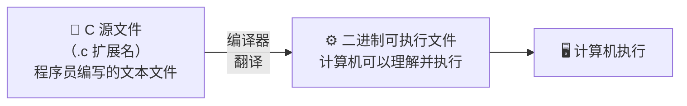

# 快速入门

## 第一个 C 程序

学习一门编程语言最有效的办法就是使用它编写程序。现在，编写我们的第一个 C 程序：显示双关语

```c title="pun.c" linenums="1"
#include <stdio.h> // (1)!

int main(void) {
    printf("To C, or not to c; that is the question.\n"); // (2)!
    return 0; // (3)!
}
```

1. `#include <stdio.h>` 对于大多数 C 程序来说是必不可少的，它 **包含** 了 C 标准输入输出库的相关信息
2. `printf(...)` 调用一个名为 `printf` 的函数，它是来自 `<stdio.h>` 中声明的输出函数，用于向屏幕输出格式化文本
3. `return 0;` 表示程序终止时向操作系统返回值 $0$

> [!TIP]
> 本质上来说，C 程序是由程序员编写的一个文本文件，存储在磁盘上的某个位置；它表示我们希望计算机做的事情。

C 程序表示的是我们希望计算机做的事情，但是计算机无法理解它。这里，我们需要一个称为 **编译器** 的特殊程序，它会帮助我们将 C 程序翻译为计算机可以理解的 **二进制代码(可执行文件)**。下图说明了其中存在的关系



> [!TIP]
> 简单说：源文件是程序员写的，可执行文件是机器跑的，**编译器**是中间的翻译官

[GCC] 是目前使用最广泛的 C 编译器，大部分 Linux 发行版都是内置了这个编译器程序，通常命名为 `cc` 或者 `gcc`。我们可以尝试使用下面的命令编译器示例程序

```shell
gcc -Wall -std=c23 -o pun pun.c
```

|命令行参数|描述|
|:--------|:---|
|`gcc`|编译程序|
|`-Wall`|编译器应该发现任何异常都进行告警|
|`-o pun`|编译器输出结果放在名为 `pun` 的文件中|
|`pun.c`|指明源文件|

编译完成后，我们就得到了想要的可执行文件。现在，可以运行该程序，只需要在终端中输入。不出意外，我们可以看到如下输出

```shell
➜ ./pun
To C, or not to c; that is the question.
```

## 简单程序的一般形式

对于像 `pun.c` 这样可以在一个源文件中完成的程序，其一般形式如下

```c
/* 预处理指令 */
....
/* 预处理指令 */

int main(void) {
    /* 语句 */
    ....
    /* 语句 */
    return 0;
}
```

### 预处理指令

在编译 C 程序之前，预处理器会首先对其进行编辑。我们把预处理执行的命令称为 **预处理指令**。这里我们只关注 `#include` 指令

```c
#include <stdio.h>
```

在编译前把 `<stdio.h>` 中的信息复制到程序中。`<stdio.h>` 包含 C 标准输入输出库的信息。C 语言拥有大量类似于 `<stdio.h>` 的**头文件**，每个头文件都包含一些标准库的内容。

> [!TIP]
> 这段程序中包含 `<stdio.h>` 的原因是 C 语言不同于其他的编程语言，它没有内置的 **读** 和 **写** 命令。**输入/输出功能由标准库中的函数实现**

所有的预处理指令都是以字符 `#` 开始的。这个字符可以把 C 程序中的预处理指令和其他代码区分开来。**预处理指令默认只占一行**，每条预处理指令的**结尾没有分号**或**其他特殊标记**

### 函数

**函数** 是用来构建 C 程序的基本构件块。事实上，C 程序就是函数的集合；这些函数可以分为两类：**自定义函数** 和 **库函数**

> [!NOTE]
> C 语言中的函数仅仅是一系列组合在一起并且被赋予了名字的 **语句**

C 程序由一系列的函数组成；这些函数中有一个特殊的函数其名字为 `main`，它是在托管环境中的 **主入口点**

> [!TIP]
> C 标准（ISO/IEC 9899:2024）定义了两种执行环境：**托管环境** 和 **独立环境**。这种两种环境的比较如下
>
> | 特性     | 托管环境       | 独立环境      |
> | -------- | -------------- | ------------- |
> | 操作系统 | ✅ 有           | ❌ 无（可能有）|
> | 标准库   | ✅ 完整         | ⚠️ 极少        |
> | 入口函数 | `main`         | 实现定义      |
> | 内存管理 | `malloc/free`  | 自行实现      |
> | I/O      | `printf/scanf` | 直接操作硬件  |
> | 典型应用 | 普通软件       | 嵌入式/OS内核 |

C 标准严格定义了两种 `main` 函数形式

```c
int main(void);                     // 不需要命令行参数
int main(int argc, char* argv[]);   // 接受任意数量的命令行参数
```

从 C90 标准起，`main` 函数必须返回一个 `int` 类型的值；在 `main` 函数中的 `return` 语句后面必须有一个整数表达式

### 语句

**语句**是程序运行时执行的命令；换句话说，它告诉编译器如何处理已经声明的标识符。在 C 语言中，**语句** 通常是用于 **控制** 程序的执行流；因此在 [控制] 中我们将介绍大部分 C 语言的语句

程序 `pun.c` 只涉及了两种语句: **return语句** 和 **函数调用语句**；要求函数执行分派给它的任务称为 **调用** 这个函数。例如，在终端中输出一个字符串

```c
printf("To C, or not to c; that is the question.\n");
```

**C 语言规定每条语句都要以分号结尾**。由于语句可以连续占用多行，有时很难确定它的结束位置，因此用分号来向编译器显示语句的结束位置。但指令通常只占一行，因此不需要用分号结尾。

> [!WARNING]
> 就像任何好的规则一样，这条规则也有一个例外：后面会遇到的 **复合语句** 就不以分号结尾。包围在花括号 `{...}` 中的至少 $0$ 条语句称为 **复合语句**；复合语句是以 `{...}` 界定的，因此不需要使用分号标记复合语句的结束

## 注释

在 C 程序，包围在 `/* ... */` 中或当前行位于 `//` 之后的内容都是 **注释**；**编译器会忽略 C 程序中的所有注释**

```c
/* 这是传统 C 风格注释，可以跨多行 */

// 这是 C++ 风格注释，只到行尾
```

## 变量和赋值

大多数程序在产生输出之前往往需要执行一系列的计算，计算过程中使用的数据被存储在执行环境中的一块 **存储区域** 中。**变量** 就是访问这块存储区域的钥匙。

### 类型

每一个变量都必须有一个 **类型**；类型用来说明变量所存储的数据的种类。C 语言提供了非常丰富的类型，但目前只需要了解 `int` 和 `double` 两个类型即可

> [!WARNING]
> 请注意：类型决定了变量的存储方式和允许对变量进行的操作，所以为变量选择选择合适的类型是非常关键的

`int` 是一种 **整数类型**，该类型的变量只允许存储整数。`double` 是一种 **浮点数类型**，该类型的变量允许存储带小数位的数。在进行算数运算时，`double` 类型通常比 `int` 类型慢；但是，`double` 类型可以存储的数值范围远远大于 `int` 类型

> [!NOTE]
> `int` 类型的变量在现代系统上通常占用 $4$ 字节（$32$ 位），能够存储整数的范围在 $-2147483648 \sim 2147483647$ 之间；`double` 类型的变量能够存储的范围远大于这个范围，具体取决于浮点数表示方式

`double` 类型存储的数值往往只是真实数值的一个近似值。例如，$0.2$ 在我使用的机器的实际值是：

```
0.200,000,000,000,000,011,1...
```

### 声明

在使用变量之前必须对其进行 **声明**：首先，指定变量的 **类型**，然后说明变量的 **名字**；变量的名字由程序员决定。例如，我们可以声明如下变量

```c
int height;     // 声明一个 `int` 类型的变量
double profit;  // 声明一个 `double` 类型的变量
```

### 赋值

变量通过 **赋值** 获得值

```c
height = 8;
length = 12;
width  = 10;
```

分别将 **字面值** `8` `12` 和 `10` 分别赋值给变量。字面值顾名思义就是 **字面上就是一个值**；它是程序的一部分，用于在源代码中直接表示值而不是其他任何东西

变量一旦被赋值，就可以使用它来辅助计算其他变量的值

```c
volume = height * length * width;
```

这里的 `*` 表示乘法运算符，因此上述语句将 `height` `length` 和 `width` $3$ 个变量中的数值相乘，然后将运算结构赋值给变量 `volume`

> [!TIP]
> 赋值运算的右侧可以是一个含有常量、变量和运算符的公式；C 语言称为 **表达式**。在表达式后面加上分号 `;` 就形成了表达式语句

### 输出变量的值

我们可以使用 `printf` 输出变量的当前值。例如

```c
printf("height: %d\n", height);
printf("Profit: $%f\n", profit);
```

函数 `printf` 的第一个参数称为 **格式化字符串**；其中以 `%{.}` 称为 **格式说明符**，也称为 **占位符**；表示输出中要插入变量值的位置。`printf` 的剩余参数就是需要插入到格式化字符串中的值；有几个占位符就应该有几个剩余参数

> [!TIP]
> 格式说明符的通用形式一般为: `%[标志][最小宽度][.精度][长度修饰符]转换说明符`；由方括号包围的部分是可选的。请注意，各个部分的 **顺序不能改变**
>
> 类型转换说明: 目标值的类型，根据类型决定如何显示目标值
>
> + `%d` 只用格式化 `int` 类型的值，采用十进制形式输出
> + `%f` 只用于格式化浮点数类型的值，采用定点形式（也称为十进制小数）输出
> + `%lf` 用于 `scanf` 读入 `double` 类型的值（`printf` 用 `%f`，`scanf` 用 `%lf`）
> + `%c` 用于格式化 `char` 类型的值
> + `%s` 用于格式化字符串（`char[]`）
> + `%zu` 用于格式化 `size_t` 类型的值
>
> 最小宽度: 最少显示多少个字符。如果要显示的数值所需字符小于最小宽度，那么数值在格式说明符位置右对齐（值的前面补充空格）
>
> 精度: 精度的含义依赖于类型说明符
>
> + `d`: 精度表示最少显示多少个十进制数符；必要时在数值前面补充零
> + `f` 和 `e`: 精度表示十进制小数点后的数字个数
> + `g`: 精度表示最多显示的有效数字个数

### 示例程序: 计算箱子的空间重量

运输公司最不喜欢的就是那种大而轻的箱子，因为这种箱子会占用运输时的宝贵空间。因此，运输公式要求这种箱子按照体积支付运费而不是重量。具体的计算规则是: 体积除以 $166$(立方英寸/磅)。如果商大于箱子的实际重量，则按照空间重量来计费。请注意，运输公司通常是将结果向上舍入进行计费的

```c title="dweight.c" linenums="1"
/* dweight.c - 计算箱子的空间重量 */

#include <stdio.h>

int main(int argc, char *argv[]) {

    int height;  // 箱子的高度
    int length;  // 箱子的长度
    int width;   // 箱子的宽度
    int volume;  // 箱子的体积
    int weight;  // 箱子的重量

    height = 8;
    length = 12;
    width = 10;
    volume = height * length * width;
    weight = (volume + 165) / 166;

    printf("Dimensions: %d x %d x %d\n", length, width, height);
    printf("Volume (cubic inches): %d\n", volume);
    printf("Dimensional weight (pounds): %d\n", weight);

    return 0;
}
```

<details>
<summary><strong>NOTE: 编译并运行</strong></summary>

> [!NOTE]
> ```shell
> ➜ gcc -Wall -std=c23 -o dweight dweight.c
> ➜ ./dweight
> Dimensions: 12 x 10 x 8
> Volume (cubic inches): 960
> Dimensional weight (pounds): 6
> ```

</details>

## 输入输出

程序 `dweight.c` 并不是十分有用，因为它仅能计算一个种箱子的空间重量。为了改进程序，需要运行用户自行输入箱子的尺寸

标准库 `<stdio.h>` 提供了一个名为 `scanf` 的函数，它用于从标准输入中读取字符，并按照格式化说明符进行转换；与 `printf` 使用相同的格式说明符

```c
scanf("%d", &height); // 读入一个 int 类型的值并存储在 `height` 中
scanf("%lf", &profit); // 读入一个 double 类型的值并存储在 `profit` 中
```

> [!WARNING]
> 请注意，`&height` 前的 `&` 符号必须存在；它是一个运算符，会在后续内容中介绍。目前，很难解释它
>
> 使用 `scanf` 读入 `double` 类型的值时，请使用 `%lf` 作为格式说明符

### 示例程序: 计算箱子的空间重量

使用 `scanf` 改进 `dweight.c` 程序；用户可以输入箱子的尺寸

```c title="dweight2.c" linenums="1"
/* dweight.c - 计算箱子的空间重量 */

#include <stdio.h>

int main(int argc, char *argv[]) {

    int height;  // 箱子的高度
    int length;  // 箱子的长度
    int width;   // 箱子的宽度
    int volume;  // 箱子的体积
    int weight;  // 箱子的重量

    printf("Enter height of box: ");
    scanf("%d", &height);
    printf("Enter length of box: ");
    scanf("%d", &length);
    printf("Enter width of box: ");
    scanf("%d", &width);

    volume = height * length * width;
    weight = (volume + 165) / 166;

    printf("Dimensions: %d x %d x %d\n", length, width, height);
    printf("Volume (cubic inches): %d\n", volume);
    printf("Dimensional weight (pounds): %d\n", weight);

    return 0;
}
```

<details>
<summary><strong>NOTE: 编译并运行</strong></summary>

> [!NOTE]
> ```shell
> ➜ gcc -Wall -std=c23 -o dweight dweight2.c
> ➜ ./dweight
> Enter height of box: 8
> Enter length of box: 12
> Enter width of box: 10
> Dimensions: 12 x 10 x 8
> Volume (cubic inches): 960
> Dimensional weight (pounds): 6
> ```

</details>

## 命名常量

当程序中需要使用常量时，建议给这些常量命名。程序 `dweight.c` 和 `dweight2.c` 中都用到了常量 `166`。在以后阅读程序时，这个常量的函数时不明确的；这些类型的常量称为 **魔法数字** 或者 **幻数**

因此，我们需要给创建 **命名常量**，从而避免在程序中使用幻数。C 语言提供了 $5$ 中创建命名常量的机制；这里我们介绍 **宏定义**

```c
#define INCHES_PER_POUND 166  // 立方英寸每磅：1 磅等价的体积是 166 立方英寸
```

`#define` 也是一种预处理指令；当程序在编译时，预处理器会把每个宏简单替换为其表示的值

```c
weight = (volume + INCHES_PER_POUND - 1) / INCHES_PER_POUND
```

将变成

```
weight = (volume + 166 - 1) / 166
```

> [!WARNING]
> 宏只会进行简单的文本替换；当替换文本中出现运算符时，应该使用括号括起来
>
> ```c
> #define RECIPROCAL_OF_PI (1.0f / 3.14159f)
> ```

### 示例程序: 氏温度转换为摄氏温度

这个示例程序允许用户输入一个华氏温度，然后输出一个对应的摄氏温度

```c title="celsius.c" linenums="1"
/* celius.c - 华氏温度转摄氏温度 */

#include <stdio.h>

#define FREEZING_PT 32.0
#define SCALE_FACTOR (5.0 / 9.0)

int main(void) {
    double fahrenheit, celsius;

    printf("Enter Fahrenheit temperature: ");
    scanf("%lf", &fahrenheit);
    celsius = (fahrenheit - FREEZING_PT) * SCALE_FACTOR;
    printf("Celsius equivalent: %.2f\n", celsius);
    return 0;
}
```

<details>
<summary><strong>NOTE: 编译并运行</strong></summary>

> [!NOTE]
> ```shell
> ➜ gcc -Wall -std=c23 -o celsius celsius.c
> ➜ ./celsius
> Enter Fahrenheit temperature: 212
> Celsius equivalent: 100.00
> ```

</details>

## 标识符

**标识符** 是用来命名变量、函数、类型、宏等的符号。C 语言对标识符有以下硬性规定：

> [!TIP]
> 标识符只能由以下字符组成
>
> + 字母: `a-z` 和 `A-Z`
> + 数字: `0-9`
> + 下划线: `_`
> + 通用字符名（C99 起）: 如 `\u00C0`（用于非 ASCII 字符）
>
> 并且**必须**以字母或下划线开头，不允许以数字开头。下面时一些合法的标识符
>
> ```c
> int count;        // ✅ 合法
> int _temp;        // ✅ 合法
> int count2;       // ✅ 合法
> int 2count;       // ❌ 非法：不能以数字开头
> int my-var;       // ❌ 非法：连字符 `-` 不是合法字符
> int my var;       // ❌ 非法：空格不允许
> ```
>
> 标识符是**大小写敏感**的
>
> ```c
> int count;
> int Count;
> int COUNT;
> // 这是三个不同的标识符
> ```
>
> **不能使用关键字作为标识符**。C23 标准有 $44$ 个关键字，这些关键字由语言本身使用，不允许用作标识符
>
> ```c
> auto        break       case        char        const       continue
> default     do          double      else        enum        extern
> float       for         goto        if          inline      int
> long        register    restrict    return      short       signed
> sizeof      static      struct      switch      typedef     union
> unsigned    void        volatile    while       _Alignas    _Alignof
> _Atomic     _Bool       _Complex    _Generic    _Imaginary  _Noreturn
> _Static_assert  _Thread_local
> ```
>
> 保留字: 以 `_` 或 `__` 开头的标识符留给编译器和标准库实现，用户代码中避免使用。

> [!TIP]
> + C89：前 31 个字符有效（外部链接标识符前 6 个字符有效）
> + C99 起：前 63 个字符有效（外部链接标识符前 31 个字符有效）
> + C11 起：进一步放宽到 63 / 31
>
> 实际上现代编译器支持更长的标识符，但前 $63$ 个字符是标准保证的区分范围。

## C 程序规范

下面将进入 C 语言的学习，在正式开始之前，我们需要介绍以下 C 程序的书写规范。C 程序可以看作是一系列 **记号(token)**

> [!TIP]
> C 程序中的记号有以下几类
>
> + 标识符
> + 关键字
> + 标点符号
> + 运算符
> + 字面值

例如，语句

```c
printf("Height: %d\n", height);
```

可以拆分为 $7$ 个记号，分别是

```c
printf   (   "Height: %d\n"   ,    height   )   ;
   ①     ②         ③          ④       ⑤     ⑥   ⑦
```

| 记号              | 种类     |
| :---------------- | :------- |
| `printf` `height` | 标识符   |
| `(` `,` `)` `;`   | 标点符号 |
| `"Height: %d\n"`  | 字面值   |

> [!WARNING]
> 记号之间的空格是没有要求的。大多数情况下不需要在记号之间保留空格，除非两个记号合并后会产生第三个记号

例如，下面的 C 程序完全正确，但是这样的程序没有任何可读性，非常不利于程序的后期维护。

```c
/* Converts a Fahrenheit temperature to Celsius */
#include <stdio.h>
#define FREEZING_PT 32.0f
#define SCALE_FACTOR (5.0f/9.0f)
int main(void){float fahrenheit,celsius;printf(
"Enter Fahrenheit temperature: ");scanf("%f",  &fahrenheit);
celsius=(fahrenheit-FREEZING_PT)*SCALE_FACTOR;
printf("Celsius equivalent: %.1f\n", celsius);return 0;}
```

事实上，**添加足够的空格和空行可以使程序更便于阅读和理解**。幸运的是，C 语言允许在记号之间插入任意数量的间隔，这些间隔可以是空格符、制表符和换行符。下面介绍一些我们需要遵守的 C 程序编码规则

+ **语句可以拆分在多行上**：对于非常长的语句，拆分在多行上书写有利于程序可读性
+ **记号之间的空格** 可以是我们更容易区分记号
+ **缩进** 有助于轻松识别不同的程序块
+ **空行** 可以把程序划分成逻辑单元，提高程序可读性

例如程序 `celsius.c` 根据上述规则就可以按照以下格式编排

```c
/* celsius.c - 华氏温度转摄氏温度 */

#include <stdio.h>

#define FREEZING_PT 32.0
#define SCALE_FACTOR (5.0 / 9.0)

int main(void) {
    double fahrenheit, celsius;
    // 缩进轻松识别 main 函数的程序块
    printf("Enter Fahrenheit temperature: ");
    scanf("%lf", &fahrenheit);  // 空格分隔不同的逻辑单元

    celsius = (fahrenheit - FREEZING_PT) * SCALE_FACTOR;

    printf("Celsius equivalent: %.2f\n", celsius);

    return 0;
}
```
